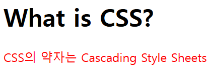
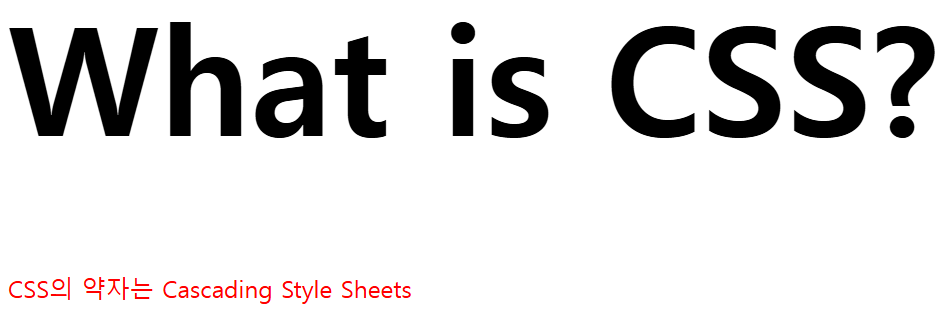
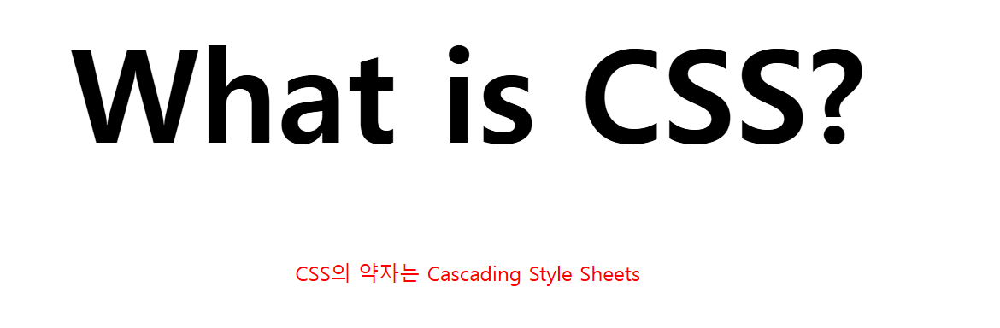
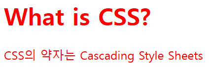

## CSS란?

CSS는 Cascading Style Sheets의 약자이다. HTML이 정보를 표현한다면 CSS는 HTML 문서를 시각적으로 꾸미는 역할을 한다.

HTML 문서를 시각적을 꾸미는 언어, 왜 HTML에 꾸미기 기능을 넣지 않고 CSS를 별도로 만들었을까?

HTML 코드와 꾸미기 코드를 분리하면 가독성과 효율성 모두 높아지기 때문이다. 예를 들어 HTML 페이지에 구조 코드와 꾸미기 코드를 모두 작성하면 둘이 뒤섞이게 된다. 꾸미기 효과를 변경하려면 HTML 이곳저것을 뒤져 일일이 수정해야한다. 하지만 꾸미기 코드를 분리하면 꾸미기 코드 관리가 쉬워지고 HTML은 구조 자체에 집중할 수 있다.

그래서 꾸미기 코드인 CSS를 만든다. 결과적으로 CSS는 꾸미기를 담당한다. 읽기 종혹 사후관리가 편한 코드를 작성하고 싶으면 HTML 파일과 CSS 파일을 따로 만들자

## CSS 적용하기

'내가 지금부터 작성하려는 건 CSS고 너는 이걸로 HTML을 예쁘게 꾸며줘'를 컴퓨터 문법으로 작성한다면?? 가장 쉬운 방법부터 말하자면 이 방법은 긴 CSS 코드를 작성할 땐 추천하지 않는다. 간단하게 스타일을 적용해볼 수 있는 방법이다.

바로 HTML에 style 태그를 사용하는 것이다.

```html
  <style>
    css 코드
  </style>
```

style 태그를 사용하면 HTML이 웹 브라우저에게 다음과 같은 말을 전한다.

"이 style 태그 안쪽에 있는 코드는 CSS야. CSS 문법에 맞춰 해석하고 처리해줘"

예를 들어 아래와 같이 h 태그와 p 태그를 이용한 페이지가 있다고 가정하자.

```html
  <h1>What is CSS?</h1>
    <p>
      CSS의 약자는 Cascading Style Sheets 
    </p>
```

p 태그에 있는 설명을 빨간색으로 바꿔보자. style 태그를 만들고 'p 태그에 빨간색을 적용한다'는 의미를 가진 CSS 코드를 작성해보자.

```html
  <style>
    p {
      color : red;
    }
  </style>
```



사진처럼 p 태그에 있는 설명이 빨간색으로 바뀐것 을 확인할 수 있다.

원리는 p 태그에 색깔 CSS를 적용하는 것이다. style 태그 안 코드를 살펴보자

```html
<style> <!-- 1 --> (css 코드)
   (선택자) p <!-- 2 -->  (적용범위) { <!-- 3 -->
   (속성) color <!-- 4 --> : (속성값) red <!-- 5 -->  (단일 속성 지정 마침 기호); <!-- 6 -->
  (적용범위) } <!-- 3 -->
</style> <!-- 1 -->
```

`1` style 태그 안에 `2` 적용하려는 태그 p를 적는다. 이때 p 태그를 CSS에서는 '선택자(Selector)'라고 부른다. 이어서 `3` 중괄호 {}로 둘러싼다. 이 중괄호 {} 안에 있는 모든 코드는 선택자인 p 태그에 적용된다 `4` 글자색을 바꾸는 데 `color` 속성을 사용한다. `5` color: 뒤에 원하는 색깔을 적는다. 색깔 이름뿐만 아니라 컬로 코드를 써도 된다. 코드 작성이 끝나면 `6` 세미콜론 ; 을 찍어야 한다. '명령이 끝났다' 라는 의미이다.

극단적으로 생각해보자. 

p 태그를 100번 사용하는 HTML 코드가 있고 색깔을 변경해야 하는데, style 태그를 사용하지 않으면?? 일일이 색을 지정해줘야 한다. 하지만 style 태그를 사용해 반복 작업이 확 줄어드는 장점이 있다.

## 외부 CSS 파일 적용하기

style 태그 안에서 CSS를 적용하는 방법은 효율적이지 않다. 코드가 길어질수록 HTML 파일 길이도 길어지기 때문이다. HTML에서 외부 CSS 파일을 불러오도록 만드는 것이 좋다.

head 태그 안에 `1` 다음와 같이 입력한다. 그러면 외부 스타일시트와 연결된다.


```html
<!DOCTYPE html>
<html lang="ko">
<head>
  <link rel="stylesheet" href="style.css" /> <!-- 1 -->
  <meta charset="UTF-8" />
  <meta name="viewport" content="width=device-width, initial-scale=1.0" />
  <title>CSS</title>
</head>
<body>

  <style>
    p {
      color : red;
    }
  </style>
    <h1>What is CSS?</h1>
    <p>CSS의 약자는 Cascading Style Sheets </p>
    
</body>
</html>
```
`1` link 태그는 외부 자원을 링크할 때 사용한다. 여기서 stylesheet는 링크할 문서 형식, style.css는 파일명이다.

- `link` : 현재 문서와 외부 리소스의 관계를 명시한다.
- `rel` : 현재 문서와 연결한 리소스의 관계를 설명한다.
- `href` : 연결할 리소스의 URL이다.

---
style.css는 아래와 작성.

```css
p {
  color : red;
}
```

보이는 결과는 같지만, HTML 파일에서 꾸미기 코드를 분리했기 때문에 효율성이 훨씬 상승했다.

## 글씨 크기

`font-size`는 글씨 크기를 조절하는 CSS 속성이다. 글씨 크기를 px, % 등으로 나타낼 수 있다.

stlye.css에서 h1 태그의 폰트 사이즈는 100px;로 지정해보자

```css
  h1 {
    font-size : 100px;
  }
```



## 글씨 정렬

정렬도 CSS 스타일이다. MDN 문서 검색을 통해 나타타는 결과 `text-align`이 정렬 속성이라고 알려준다.

예제 코드를 보니 left, right, center, jusify 값을 쓸 수 있다.

마찬가지로 style.css 에서만 수정을 하고 확인해보자.

```css
  h1 {
    font-size : 100px;
    text-align : center;
  }
  p {
    text-align : center;
  }
```



---
실행결과 글씨 크기 조절, 글자 정렬하는 방법까지 보았다.

## CSS 선택자

CSS 선택자(Selector)는 HTML에 스타일을 적용할 때 HTML 요소를 지정하는 역할을 한다. 예를 들어 h1 태그에 스타일을 적용하고 싶을 때 h1을 선택한다. 이때 h1이 선택자가 되는 것이다!

한 가지 의문점이 생긴다. '작성한 모든 태그에 스타일을 적용하려면 일일이 태그르 적어야 할까?' 또는 '작성한 p 태그 중 첫 p 태그만 CSS를 적용하고 싶은에 어떡하지?' 말이다.

이때는 선택자를 이용하여 의문점을 해결할 수 있다.

선택자를 사용하는 5가지 방법이 있다.

- 전체 선택자
- 유형 선택자
- 아이디 선택자
- 클래스 선택자
- 복합 선택자

## 전체 선택자

전체 선택자(universal selector)는 모든 HTML 문서를 선택해 스타일을 적용해준다. 특정 태그 대신 * 기호를 사용한다. 

```html
  <style>
    * {
      color : red;
    }
  </style>
```


---
`*`은 head를 포함한 HTML 문서 내의 모든 요소를 선택한다. 실행 결과 전부 빨간색으로 표시

## 유형 선택자

유형 선택자(type selector)는 이미 위에서 사용한 것 처럼. 특정 태그를 지정해 작성하는 방식이다. 타입 셀렉터라고도 말한다.


```html
  <style>
    p {
      color : red;
    }
  </style>
```
`태그명` 지정된 태그를 가지는 요소를 선택한다.

## 아이디 선택자

아이디 선택자는