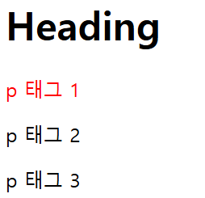
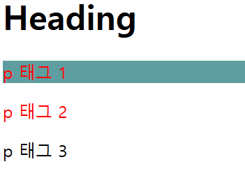
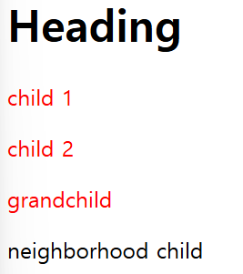

## CSS란?

`CSS`는 **Cascading Style Sheets**의 약자이다. `HTML`이 정보를 표현한다면 `CSS`는 `HTML` 문서를 시각적으로 꾸미는 역할을 한다.

`HTML` 문서를 시각적을 꾸미는 언어, 왜 `HTML`에 꾸미기 기능을 넣지 않고 `CSS`를 **별도**로 만들었을까?

**HTML 코드**와 **꾸미기 코드**를 **분리**하면 **가독성**과 **효율성** 모두 높아지기 때문이다. 예를 들어 HTML 페이지에 구조 코드와 꾸미기 코드를 모두 작성하면 둘이 뒤섞이게 된다. 꾸미기 효과를 변경하려면 HTML 이곳저것을 뒤져 일일이 수정해야한다. 하지만 꾸미기 코드를 분리하면 꾸미기 코드 관리가 쉬워지고 HTML은 구조 자체에 집중할 수 있다.

그래서 꾸미기 코드인 CSS를 만든다. 결과적으로 CSS는 꾸미기를 담당한다. 읽기 종혹 사후관리가 편한 코드를 작성하고 싶으면 HTML 파일과 CSS 파일을 따로 만들자

## CSS 적용하기

'**내가 지금부터 작성하려는 건 CSS고 너는 이걸로 HTML을 예쁘게 꾸며줘**'를 컴퓨터 문법으로 작성한다면?? 가장 쉬운 방법부터 말하자면 이 방법은 긴 CSS 코드를 작성할 땐 추천하지 않는다. 간단하게 스타일을 적용해볼 수 있는 방법이다.

바로 `HTML`에 `style` 태그를 사용하는 것이다.

```html
  <style>
    css 코드
  </style>
```

`style` 태그를 사용하면 `HTML`이 웹 브라우저에게 다음과 같은 말을 전한다.

"**이 style 태그 안쪽에 있는 코드는 CSS야. CSS 문법에 맞춰 해석하고 처리해줘**"

예를 들어 아래와 같이 `h` 태그와 `p` 태그를 이용한 페이지가 있다고 가정하자.

```html
  <h1>What is CSS?</h1> <!-- h태그 -->
    <p>                 <!-- p태그 -->
      CSS의 약자는 Cascading Style Sheets <!-- 설명 -->
    </p>
```

`p` 태그에 있는 설명을 빨간색으로 바꿔보자. `style` 태그를 만들고 '**p 태그에 빨간색을 적용한다**'는 의미를 가진 CSS 코드를 작성해보자.

```html
  <style>
    p {
      color : red;
    }
  </style>
```


사진처럼 p 태그에 있는 설명이 빨간색으로 바뀐것 을 확인할 수 있다.

원리는 p 태그에 색깔 CSS를 적용하는 것이다. style 태그 안 코드를 살펴보자

```html
<style> <!-- 1 --> (css 코드)
   (선택자) p <!-- 2 -->  (적용범위) { <!-- 3 -->
   (속성) color <!-- 4 --> : (속성값) red <!-- 5 -->  (단일 속성 지정 마침 기호); <!-- 6 -->
  (적용범위) } <!-- 3 -->
</style> <!-- 1 -->
```

`1` style 태그 안에 `2` 적용하려는 태그 p를 적는다. 이때 p 태그를 CSS에서는 '**선택자(Selector)**'라고 부른다. 이어서 `3` 중괄호 {}로 둘러싼다. 이 중괄호 {} 안에 있는 모든 코드는 선택자인 p 태그에 적용된다
 `4` 글자색을 바꾸는 데 `color` 속성을 사용한다. `5` color: 뒤에 원하는 색깔을 적는다. 색깔 이름뿐만 아니라 컬러 코드를 써도 된다.
  코드 작성이 끝나면 `6` 세미콜론 ; 을 찍어야 한다. '**명령이 끝났다**' 라는 의미이다.

**극단적으로 생각해보면!** 

p 태그를 100번 사용하는 HTML 코드가 있고 색깔을 변경해야 하는데, style 태그를 사용하지 않으면?? 일일이 색을 지정해줘야 한다. 하지만 style 태그를 사용해 반복 작업이 확 줄어드는 장점이 있다.

## 외부 CSS 파일 적용하기

style 태그 안에서 CSS를 적용하는 방법은 효율적이지 않다. 코드가 길어질수록 HTML 파일 길이도 길어지기 때문이다. HTML에서 외부 CSS 파일을 불러오도록 만드는 것이 좋다.

head 태그 안에 `1` 다음와 같이 입력한다. 그러면 외부 스타일시트와 연결된다.


```html
<!DOCTYPE html>
<html lang="ko">
<head>
  <link rel="stylesheet" href="style.css" /> <!-- 1 -->
  <meta charset="UTF-8" />
  <meta name="viewport" content="width=device-width, initial-scale=1.0" />
  <title>CSS</title>
</head>
<body>

  <style>
    p {
      color : red;
    }
  </style>
    <h1>What is CSS?</h1>
    <p>CSS의 약자는 Cascading Style Sheets </p>
    
</body>
</html>
```
`1` link 태그는 외부 자원을 링크할 때 사용한다. 여기서 stylesheet는 링크할 문서 형식, style.css는 파일명이다.

- `link` : 현재 문서와 외부 리소스의 관계를 명시한다.
- `rel` : 현재 문서와 연결한 리소스의 관계를 설명한다.
- `href` : 연결할 리소스의 URL이다.

---
style.css는 아래와 작성.

```css
p {
  color : red;
}
```

보이는 결과는 같지만, HTML 파일에서 꾸미기 코드를 분리했기 때문에 효율성이 훨씬 상승했다.

## 글씨 크기

`font-size`는 글씨 크기를 조절하는 CSS 속성이다. 글씨 크기를 px, % 등으로 나타낼 수 있다.

stlye.css에서 h1 태그의 폰트 사이즈는 100px;로 지정해보자

```css
  h1 {
    font-size : 100px;
  }
```


## 글씨 정렬

정렬도 `CSS` 스타일이다. MDN 문서 검색을 통해 나타타는 결과 `text-align`이 정렬 속성이라고 알려준다.

예제 코드를 보니 `left`, `right`, `center`, `jusify` 값을 쓸 수 있다.

마찬가지로 style.css 에서만 수정을 하고 확인해보자.

```css
  h1 {
    font-size : 100px;
    text-align : center;
  }
  p {
    text-align : center;
  }
```


---
실행결과 글씨 크기 조절, 글자 정렬하는 방법까지 보았다.

## CSS 선택자

**CSS 선택자(Selector)** 는 HTML에 스타일을 적용할 때 HTML 요소를 지정하는 역할을 한다. 예를 들어 h1 태그에 스타일을 적용하고 싶을 때 h1을 선택한다. 이때 h1이 선택자가 되는 것이다!

한 가지 의문점이 생긴다. '**작성한 모든 태그에 스타일을 적용하려면 일일이 태그를 적어야 할까?**' 또는 '작성한 p 태그 중 첫 p 태그만 CSS를 적용하고 싶은에 어떡하지?' 말이다.

이때는 선택자를 이용하여 의문점을 해결할 수 있다.

선택자를 사용하는 5가지 방법이 있다.

- **전체 선택자**
- **유형 선택자**
- **아이디 선택자**
- **클래스 선택자**
- **복합 선택자**

## 전체 선택자

**전체 선택자(universal selector)** 는 모든 HTML 문서를 선택해 스타일을 적용해준다. 특정 태그 대신 `*` 기호를 사용한다. 

```html
  <style>
    * {
      color : red;
    }
  </style>
```


---
`*`은 head를 포함한 HTML 문서 내의 모든 요소를 선택한다. 실행 결과 전부 빨간색으로 표시된 것을 확인할 수 있다.

## 유형 선택자

**유형 선택자(type selector)** 는 이미 위에서 사용한 것 처럼. 특정 태그를 지정해 작성하는 방식이다. 타입 셀렉터라고도 말한다.


```html
  <style>
    p {
      color : red;
    }
  </style>
```
`태그명` 지정된 태그를 가지는 요소를 선택한다.

## 아이디 선택자

**아이디 선택자(ID selector)** 는 `아이디`로 `요소`를 식별해주는 선택자이다. `모든 태그 요소` 중에 `특정 아이디` 하나를 선택할 떄 사용한다.
예를 들어 스타일을 적용할 `p 태그`에 `아이디`를 선언해 해당 선택자에 `스타일링`을 `적용`하는 것이다. p라는 태그 유형 대신 `선언한 아이디`로
`요소`를 `선택`하는 것이다.

**아이디 지정 방법**은 다음과 같다.

```html
<p id="아이디">텍스트</p>
```

`HTML`에서 p태그를 마감하기 전에 `id="아이디"` 형식으로 지정한다. 여기서 "`아이디`"는 `중복 되지 않는 고유한 값`이어야 한다. `주민번호`라고 생각하면 편하다

아이디 선택자의 중요한 특징이 또 한 가지가 있다. CSS에서 `아이디 선택자`를 사용하여 스타일링을할 때는 `#`을 아이디 앞에 붙여야 한다는 점이다.

```html
<style>
  #아이디{
    속성
  }
</style>
```

아래 코드는 여러 p 태그 중 하나의 아이디를 지정해 스타일링하는 예시

```html
<!DOCTYPE html>
<html>
  <head>
    <link rel="stylesheet" href="style.css">
  </head>
  <body>
    <h1>Heading</h1> <!--1-->
    <p id="p1">p 태그 1</p> <!--2-->
    <p>p 태그 2</p> <!--1-->
    <p>p 태그 3</p> <!--1-->
  </body>
</html>
```

```css
#p1 {  // id값이 p1인 요소를 선택
  color: red;
}
```



실행결과

코드에서 주석처리한 `1`은 3개의 p 태그를 작성했고, `2`는 p 태그의 id를 p1으로 지정하였다. `3` style.css에서 #p1으로 아이디 선택자를 선택하여 스타일을 지정해서 p 태그 1 만 빨간색으로 표시

## 클래스 선택자

클래스 선택자(class selector)는 특정 클래스에 속하는 요소를 선택한다. 여기서 클래스란 요소의 목록을 말한다. 아이디와 비슷한 기능을 하지만, 클래스는 여러 태그를 하나의 클래스로 묶을 수도 있고 태그 하나에 여러 클래스 이름을 붙여줄 수도 있다.

예를 들어 p 태그에 클래스 이름으로 c1,c2,c3를 지정해 각각에 스타일을 지정해놓을 수 있는 것이다.

보통 아이디 선택자보다 클래스 선택자를 많이 사용한다. 이유는 유연성과 재사용성 때문이다.

사용법은 클래스명 앞에 점 .을 붙여주면 된다.

```html
<style>
  .클래스명 {
    속성
  }
</style>
```

```html
<!DOCTYPE html>
<html>
  <head>
    <link rel="stylesheet" href="style.css">
  </head>
  <body>
    <h1>Heading</h1> <!--1-->
    <p class="container">p 태그 1</p> <!--2-->
    <p>p 태그 2</p> <!--1-->
    <p>p 태그 3</p> <!--1-->
  </body>
</html>
```

```css
.container { // class값이 container인 모든 요소 선택
  color: red;
}
```

아이디 선택자 코드와 차이점은 p 태그 1 앞 p 태그에 class로 container로 지정했다는 점이다.

만약, 클래스 선택자가 여러개라면?? p 태그 1과, p 태그 2를 빨간글씨로 나타내면서 p 태그 1만 백그라운드 컬러를 주고 싶다면 어떻게 작성해야 할까??

```html
<!DOCTYPE html>
<html>
  <head>
    <link rel="stylesheet" href="style.css">
  </head>
  <body>
    <h1>Heading</h1> 
    <p class="class-1 class-2">p 태그 1</p> <!--1-->
    <p class="class-1">p 태그 2</p> <!--2-->
    <p>p 태그 3</p> 
  </body>
</html>
```



실행 결과 코드에서 `1`에서 p 태그에는 class-1과 class-2의 스타일을 모두 적용하고, `2`두 번째 p 태그에는 class-1만을 적용한다. 이처럼 클래스 선택자는 하나 이상의 클래스값을 가질 수 있기 때문에 스타일을 주고 싶은 선택자를 자유롭게 지정할 수 있다.

아이디와 클래스 선택자의 이름은 해당 태그를 가장 잘 설명하는 단어로 짓고, 이름만 보고도 태그 역할을 알 수 있다면, 제대로 네이밍한 것이다. 좋은 네이밍 습관을 가져야 현업에서도 사랑??? 받을 수 있다....


## 복합 선택자

복합 선택자(combinator selector)는 두 개 이상의 선택자를 조합하여 특정 조건에 맞는 요소들을 더 구체적이고 정밀하게 선택하는 방법인데.

부모와 자식 태그가 복합적으로 쓰인다 해서 붙여진 이름이라고 외우면 편하다.

복합 선택자는 서로의 관계와 위치를 유용하게 결합하는 방식을 제공한다. 여기서 '서로'에는 자손 선택자, 자식 선택자, 인접 형제 선택자, 일반 형제 선택자가 속한다.

가장 많이 쓰이는 자손 선택자는 조상의 모든 자손을 선택하는 방식이다.

```html
<style>
  조상 자손 {
    속성
  }
</style>
```

```html
<!DOCTYPE html>
<html>
  <head>
    <link rel="stylesheet" href="style.css">
  </head>
  <body>
    <h1>Heading</h1> 
    <div>
      <p>child 1</p> <!--div의 자손-->
      <p>child 2</p> <!--div의 자손-->
    <div>
      <p>grandchild</p> <!--div의 자손-->
    </div>
  </div>
  <p>neighborhood child</p> <!--div의 자손이 아님-->
  </body>
</html>
```
코드를 설명하면
`1` div 태그의 자식으로 child 1과 child 2를 만들었고 `2` 만든 div 태그 안에 또 하나의 div 태그와 자식 grandchild를 만들었다 `3` CSS 선택자로 지정할 때 div 다음 띄어쓰기 후 p를 적는다. 이때 띄어쓰기는 **자손**을 가리킨다. 따라서 div 안에 있는 자식 p에 스타일을 적용한다는 의미이다.




실행결과를 토대로 쉽게 풀어서 설명하면,

1. `child 1` 와 `child 2`
   - 이들은 최상위 `div`의 **직계 자식**이다.
   - 따라서 `div p ` 선택자에 의해 스타일이 적용되어 빨간색이 된다.

2. `grandchild`
  - `grandchild`는 중첩된 `div`의 자식이지만, 최상위 `div`의 **간접 자손**(하위 요소)으로 간주된다.
  - 자손 선택자는 **직계 여부와 관계없이 모든 하위 요소를 포함**하므로, 빨간색 스타일이 적용된다.

3. `neighborhood child`
  - `div`의 자손이 아니므로 `div p` 선택자의 범위에 포함되지 않는다.
  - 따라서 기본 스타일 검정색이 적용된다.