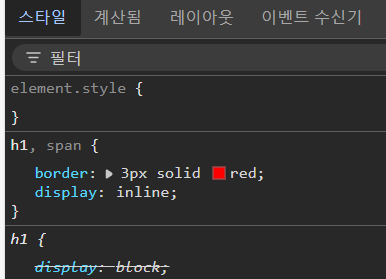

<h1>CSS 배치 속성과 반응형 웹</h1>


CSS 배치 속성과, 반응형 디자인에 대해 알아보자. 우선 `h1`태그와 `span`태그로 텍스트를 작성한 코드는 아래와 같다.

```html
<!DOCTYPE html>
<html>
  <head>
    <link rel="stylesheet" herf="style.css" />
  </head>
  <body>
    <h1>Emotion</h1>
    <span>SAD</span>
    <span>HAPPY</span>
    <span>LOVE</span>
  </body>
</html>
```

`Live Server`를 통해 확인하면 아래 사진과 같은 결과물이 나온다. `Live Server`는 확장 프로그램으로, 웹 개발자들이 HTML, CSS, JavaScript 등의 파일을 브라우저에서 **실시간으로 미리보기** 할 수 있게 해주는 도구이다.


`h1` 태그로 제목을 **Emotion**으로 지정했고, **SAD, HAPPY, LOVE** 는 `span` 태그로 줄바꿈을 하지 않고 구문 요소를 의미한다.

코드에서는 **Emotion, SAD, HAPPY, LOVE** 모두 Enter키를 이용해서 각자 다른 줄에 있는데 왜 사진에서 **Emotion**은 첫 줄에, **SAD, HAPPY, LOVE**는 같은 줄에 존재하는 것일까? 라는 **의문점**이 들어야한다.


  

Emotion과 SAD에는 어떤 태그를 사용했는지 표시되어있고, 파란색으로 크기가 지정되어있다.
개발자 도구(F12)를 이용해서 `h1`과 `span`에 마우스 커서를 올리면 위 사진처럼 파란색칸이 보이고,
body 본문안에 스타일 형식이 `display: block` 으로 표시된 것을 확인할 수 있다.

1. Emotion은 왜 파란색 칸이 길까?
2. SAD는 왜 파란색칸이 글자크기에 맞게끔 되어있을까?


 

이유는 `display: block` 으로 설정되어있기 때문이다.


`h1` 태그는 자동으로 줄바꿈이 되는 이유는, h 태그가 **블록 레벨 요소**이기 때문이다.
`h1` 태그와 `span` 태그 모두 `border`라는 속성을 사용해서 차이점을 확인해보자


`h1` 태그 테두리는 **요소 가로 화면 전체**를 둘러싸고 있고, 반면 `span` 태그 테두리는 **요소 크기**에 맞춰졌다. `h1` 태그처럼 요소의 가로 줄 전체를 차지하는 요소를 **블록 레벨 요소**(block-level-element)라 부르고, `span` 태그와 같이 요소 크기만큼의 너비를 차지하는 요소를 **인라인 레벨 요소**(inline-level-element)라 부른다. 

## 블록 레벨 요소와 인라인 레벨 요소

모든 HTML 요소에는 `display`라는 속성이 있고, 그 기본값이 **블록** 또는 **인라인**으로 설정되어 있다. **블록 레벨 요소**는 요소가 있는 **가로 줄 전체**를 차지하고, **인라인 레벨 요소**는 **요소가 있는 공간만**을 차지한다. 

그래서 위에서 h 태그는 **블록 레벨 요소**이기 때문에 **파란색이 뜻하는 건 가로 줄 전체**를 의미하고,
`span` 태그는 **인라인 레벨 요소**이기 때문에 **SAD 요소 크기만큼 파란색으로 공간**을 차지한다.

태그마다 이 두 특성은 **변하지 않는 걸까**?? 라는 의문점이 들어야 한다. `display`라는 `CSS` 속성으로 바꿔줄 수 있다. 


 


정리하면,

 `display`에서 `block/inline` 속성값을 적용한 결과는 다음과 같다. `display`값이 `block`이면 **요소 가로 줄 전체**를 차지하기 때문에 요소마다 **줄바꿈이 발생**한다. 반면 `display`값이 `inline`이면 **요소 크기**만큼 공간을 차지하기 때문에 요소 자체의 크기에 따라 **줄바꿈이 발생한다**.

 `display` 속성으로 `inline` 으로 변경하면

 ```css
 h1, span {
  border: 3px solid red;
  display: inline;
 }
 ```

  

 h 태그도 딱 콘텐츠 너비만큼만 가로 공간을 차지하게 바뀌며 같은 줄에 나타난다.


 `display` 속성으로 `block`으로 변경하면

 ```css
 h1, span {
  border: 3px solid red;
  display: block;
 }
 ```
실행결과 아래 사진처럼 가로 줄 전체를 표시하며, 모두 줄바꿈이 발생한다.


 

 사진을 보면 SAD와 HAPPY, HAPPY와 LOVE 사이 빨간 줄이 두꺼워 보이는 이유는 코드를 통해 설명할 수 있다. `border: 3px solid red;` 속성으로 테두리를 3px, solid, red로 지정했다.

 **SAD** 에도 굵기가 `3px`로 되어있고, **HAPPY**에도 `3px`로 되어 있기 때문에, 두꺼워보이는 구간은 총 `6px`이다.

 만약 일정하게 보이게 하고 싶으면 `margin`값을 설정해주면 되는데, 그 전에 박스 모델 : 마진, 테두리, 패딩 개념에 대해서 알아야 한다.


## 박스 모델 : 마진, 테두리, 패딩

**블록**과 **인라인**이라는 개념은 왜?? 존재할까? 보기 좋게 배치하기 위해서이다.
요소를 원하는 곳에 배치하려면 태그마다 가지고 있는 특성을 알아야 한다. 이때 **블록**과 **인라인**요소 외에도 레이아웃을 정하는 HTML 요소가 있다. 바로 **박스 모델**이다. `CSS` 박스 모델은 기본적으로 모든 HTML 요소를 감싸는 상자이다. 요소, 패딩(padding), 테두리(border), 마진(margin)으로 구성되어 있다.


`1`요소 : 텍스트, 사진 등 보여줄 대상
`2`패딩 : 요소 주변 영역을 감싼다. 
`3`테두리 : 요소와 패딩을 감싸는 테두리
`4`마진 : 테두리 밖의 영역을 감싼다.

텍스트나 이미지처럼 눈에 보이는 요소와 달리 마진과 패딩은 명확한 구분이 쉽지 않다.

예제를 통해 설명하자면,

1. **마진(margin)** : 택배 박스가 배송 상자 안에 들어갈 때, **박스와 배송 상자 사이의 공간**이 마진이다.
이 공간은 박스가 외부와 얼마나 떨어져 있는지를 나타낸다.

1. **마진(margin)** : 책상을 방 안에 놓았을 때, **책상과 벽 사이의 빈 공간**이 마진이다.
이 공간은 책싱이 다른 가구(요소)나 벽(테두리)과 떨어진 **바깥쪽 여백**이다.

2. **패딩(padding)** : 박스 내부에 물건을 보호하기 위해 넣는 **뽁뽁이(포장재)**가 패딩이다.
물건과 박스 벽 사이의 여유 공간을 채우는 것이 패딩이다.

2. **패딩(padding)** : 책상 위에 물건을 올려놓을 때, 물건이 놓일 **책상 표면의 여백**이 패딩이다.
이 공간은 책상 가장자리(테두리)와 물건(내용물) 사이의 **안쪽 여백**이다.

쉽게 결론을 내리면,

- **마진**은 **밖**에서 생기는 공간
- **패딩**은 **안**에서 생기는 공간
