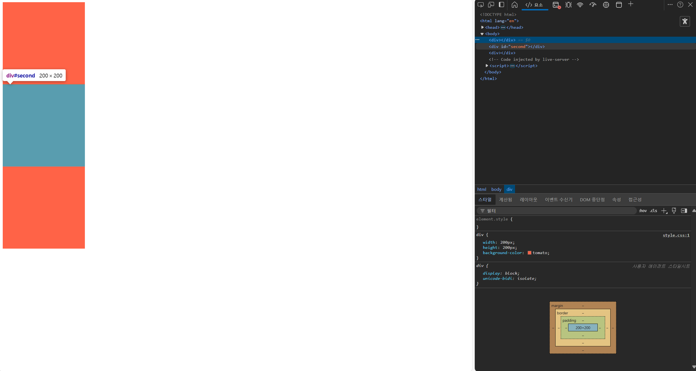
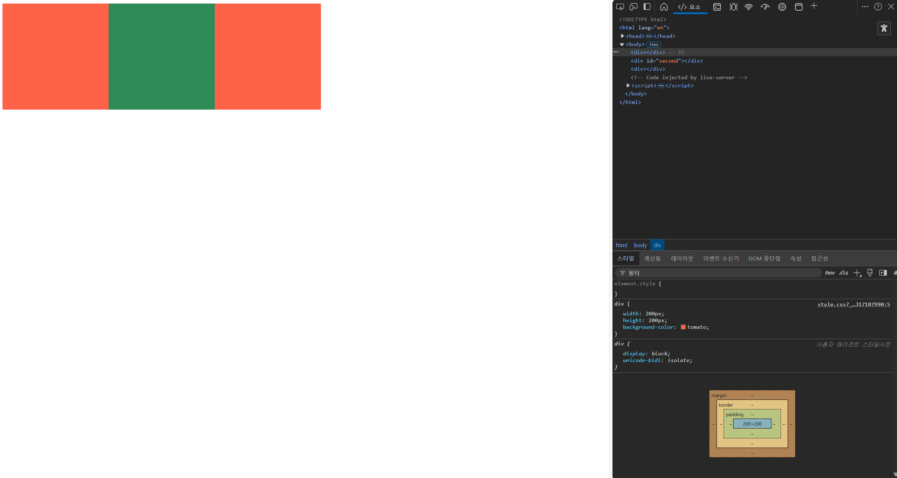
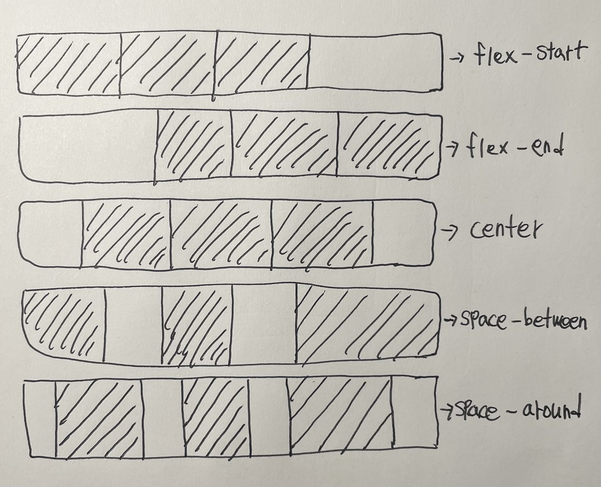
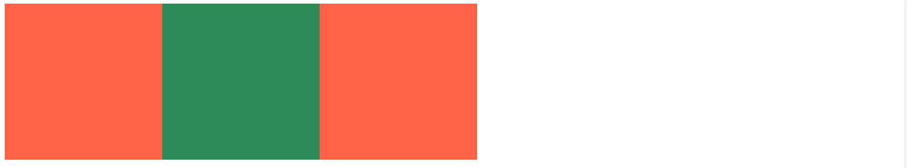
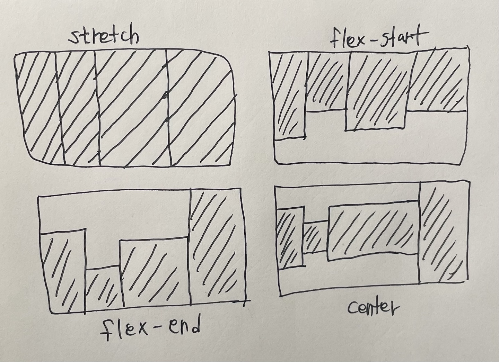
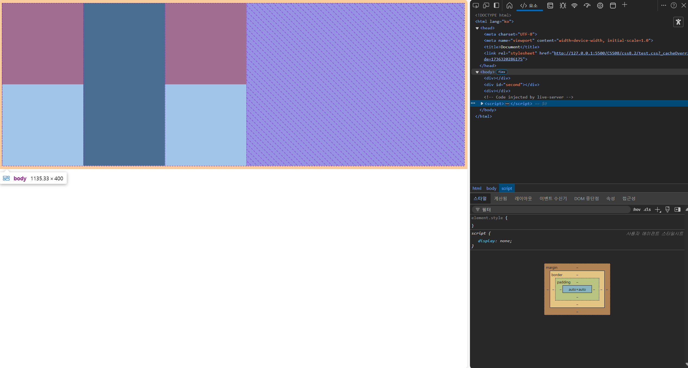
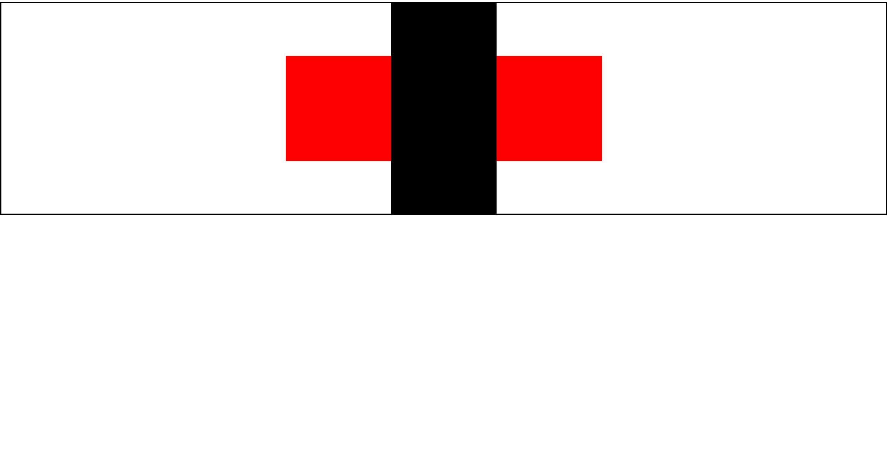
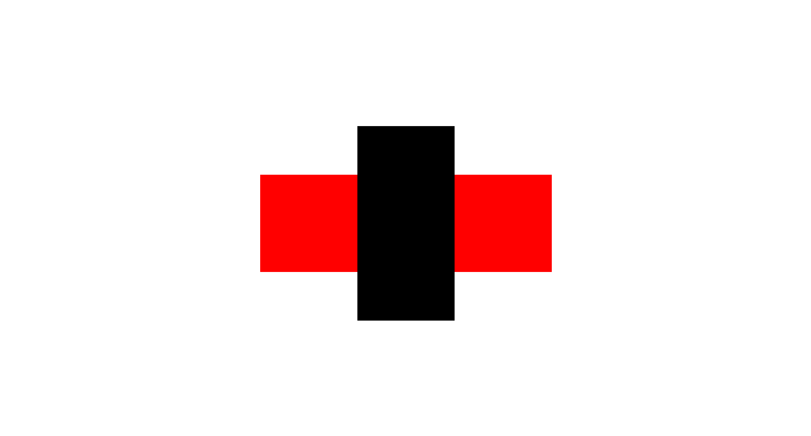

<h1>CSS 레이아웃 : flex box</h1>

## flex box의 등장

플렉스는 **'유연한'** 이란 뜻을 가지고 있다. 화면 레이아웃을 유연하게, 자유자재로 배치할 수 있게 해준다. 기존에 사용했던 블록 레벨 요소, 인라인 레벨 요소 방식보다 훨씬 강력하고 편리한 기능이 많다.

즉 다양한 레이아웃을 만들고자 고안된 기법이 **플렉스 박스(flex box)** 이다.


## flex가 필요한 순간??

`flex`는 언제 필요로 할까??? 아래와 같이 `body`안에 `div`로 정사각형 세 개를 만드는 코드가 있다고 가정하고

```html
<!DOCTYPE html>
<html>
  <head>
    <link rel="stylesheet" href="style.css">
  </head>
  <body>
    <div></div> <!--1-->
    <div id="second"></div> <!--2-->
    <div></div> <!--2-->
  </body>
</html>
```

```css
div {
  width: 200px; <!--3-->
  height: 200px; <!--4-->
  background-color: tomato;
}
#second {
  background-color: seagreen; <!--5-->
}
```



**HTML** 코드에서 `1`**body**를 부모로, `2`3가지 **div**를 그 자식으로 설정하고 CSS파일에는 **div** 태그에 `3` **width,height** 길이를 정해주고 `4` **배경색**을 넣어줬다. 또한 **div** 박스 사이의 구별이 쉽도록 가운데 박스에 **id** 값을 **second**로 지정해 `5`초록색으로 설정하였다.

첫 번째 `div` 박스에 `margin` 값이 자리를 차지하고 있는 걸 확인할 수 있다. 마진값을 없앨려면 `display`값을 인라인으로 바꿔도 가능하지만 `flex box`를 활용해보자


## flex box로 정렬하기

`flex box`는 사**용자 인터페이스 디자인에 최적화된 레이아웃을 정의**하는 **CSS**이다. 이미지, 텍스트 같은 요소를 원하는 곳에 배치하는 데 사용한다. 인라인이 단순히 여백을 없애는 데 사용한다면, `flex box`는 **여백을 없앨** 뿐만 아니라 **축**을 **변경**한다든지, **자식 간의 정렬**을 가운데로 맞출 때도 사용한다. 즉 **유연하게 박스 레이아웃을 변경**할 수 있다는 장점이 있다.

`flex box` 제 1원칙은 **"부모만이 플렉스 할 수 있다"** 이다. `flex box`를 사용하려면 부모자식 관계에서 **부모**에 적용해야 **자식**이 영향을 받는다. 

이유는 `flex box`의 설계 원칙과 렌더링 방식에 있다. 

## flex Container와 flex Item

- `flex box`는 **레이아웃 방식**인데. 이 레이아웃은 **플렉스 컨테이너**(flex container)와 **플렉스 아이템**(flex item)간의 관계에서 작동한다.
- 부모 요소에 `display: flex` 또는 `display: inline-flex`를 설정하면, 해당 **부모가 플렉스 컨테이너**가 되고, 그 내부의 **작계 자식들이 플렉스 아이템**이 된다.
- 플렉스 컨테이너에 정의된 스타일(`flex-direction`, `justify-content`, `align-items`)이 플렉스 아이템들의 배치를 제어한다.


`flex box`의 사용 방법은 아래와 같다.

```css
body {
  display<!--속성--> : flex; <!--값-->
}
```

## 공간에 맞추기 : display flex

`display` 속성은 block, inline, flow, grid, flex 가 있다. 그 중 flex는 자식 요소를 원하는 방향으로 유연하게 배치할 수 있어 자주 사용하는 속성이다.

```css
body {
  display: flex; <!--1-->
}
div {
  width: 200px;
  height: 200px;
  background-color: tomato;
}
#second {
  background-color: seagreen;
}
```



`1` body 태그에 `display`값을 `flex`로 선언하니 마진이 사자려 모든 `div`가 한 줄에 놓이게 되었다.
부모의 `display`값을 기본 설정인 block 에서 flex로 바꾸었다. 이렇게 `flex box`를 사용하면 추가적인 속성을 지정할 수 있다. 그중에 하나가 `justify-content` 속성이다.


## 주축 정렬하기 : justify-content

`justify-content` 속성은 웹 페이지의 축을 따라 요소 사이에 공간을 만드는 방법을 정의한다.
여기서 말하는 축이란 주축과 교차축을 말한다. 별도의 설정이 없다면 주축은 가로, 교차축은 세로를 기본값으로 가진다. 하지만 이 둘은 `flex-direction`이라는 속성을 사용하여 축을 변경해줄 수 있기 때문에 가로,세로 대신 주축, 교차축이라고 지칭한다. 따라서 기본값에서 주축이었던 가로 방향을 `flex-direction`을 사용해서 세로로 바꾸면 주축은 세로 방향이 되는 것이다.

다시 말해 `flex box`는 두 축(주축,교차축)을 기준으로 움직이기 때문에 축 방향을 기준으로 요소를 움직여야 한다.

`justify-content` 속성에는 다음과 같은 값이 올 수 있다.
 - `flex-start` : 시작 부분에 정렬
 - `flex-end` : 끝에 정렬
 - `center` : 중앙에 정렬
 - `space-between` : 요소가 축을 따라 펼쳐진다(각 요소 사이에 공간이 있음)
 - `space-around` : 요소가 축을 따라 펼쳐지지만 가장자리 주변에도 공간이 있다.

 `justify-content`를 이용한 가운데 정렬이 좋은 이유는 **반응형**이기 때문이다.

 

 순서대로 실행 결과를 보면,

`flex-start`
 

`flex-end`
 

`center`
 

`space-between`
 

`space-around`
 


 `div`박스를 세로축으로 가운데 정렬하고 싶으면? `align-items`라는 교차축 정렬 속성을 사용하면 된다.

 ## 교차축 정렬하기 : align-items

 `align-itmes` 속성은 교차축을 정렬한다.(flex-direction으로 축 방향을 변경해주지 않는 한 기본값인 세로축을 정렬한다.) `align-items`에는 아래와 같은 속성값이 올 수 있다.

 - `stretch` : 요소의 길ㅇ리와 교차축의 길이를 같게 한다.
 - `flex-start` : 시작 위치에 정렬
 - `flex-end` : 끝 정렬
 - `center` : 중앙 정렬

 

 ```css
 html,body {
  height: 100%; /*1*/ 
 }

 body {
  display: flex;
  align-items: center; /*2*/
 }

 div {
  width: 200px;
  height: 200px;
  background-color: tomato;
 }
 #second {
  background-color: seagreen;
 }
 ```


`2` 부모인 body에 `align-items: center`를 지정했고, `1`html과 body의 height 값을 100%로 지정했다.


## html과 body에 height값을 100%로 주어야 하는 이유!!

높이를 지정하지 않으면 화면의 높이는 요소 중 가장 긴 길이를 가진 요소를 기준으로 높이를 정한다.



HTML 코드에서 인지하는 화면 높이는 가장 긴 검정색 길이만큼이다 body크기만큼, 브라우저가 보여주는 높이는 아래 여백까지 전체높이 이고, 아래는 여백이다

중요한 것은 우리가 보는 화면의 흰 여백은 HTML이 제공하는 영역(높이)에 속하지 않는다는 점이다. 이 상태에서 가로, 세로 정렬을 하면????



가로축은 화면 길이만큼 지정됐기 때문에 중앙 정렬이 되었지만, 세로축은 가장 큰 요소의 높이를 기준으로 중앙 정렬되어 의도한 브라우저 전체 화면에서의 정렬이 되지 않았다.

이를 해결하기 위해 직접 높이를 지정하는 비율(%)을 이용하여 높잇값을 100%로 지정하는 방법이다. 이때 주의할 점은 html 태그와 body 태그 모두 높잇값을 100%로 지정해줘야 한다.



이유는 %는 부모 요소에 대해 상대적으로 길이가 정해지기 때문이다. 즉, div 태그는 부모인 body 태그와 최상위 부모인 html 태그의 높이에 대해 상대적으로 100%라는 값을 가지는 것이다.

