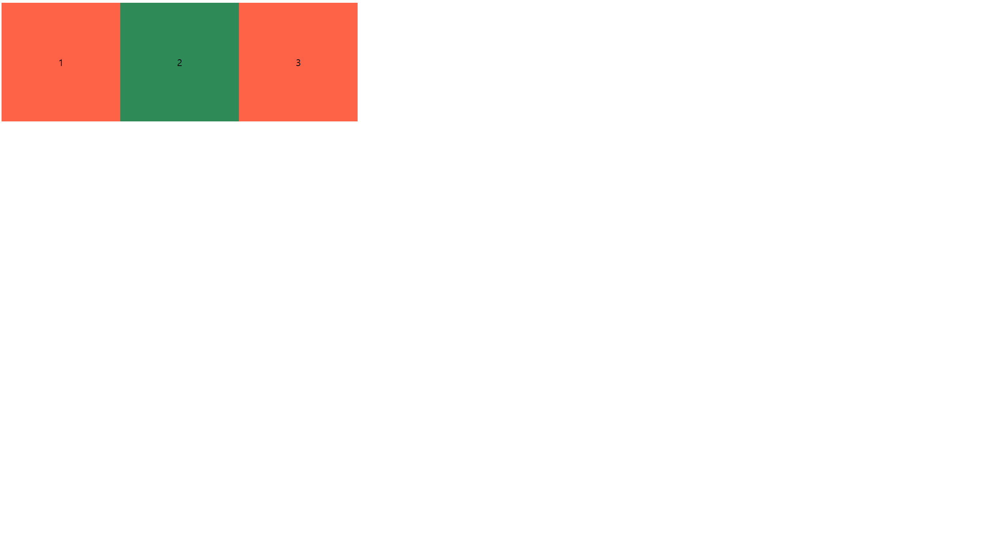

<h1>CSS 레이아웃 : 위치 지정</h1>

## 자식이 부모가 될 수 있다.

자식이 자라서 부모가 되는 것처럼 CSS에서도 자식이 부모가 될 수 있다.

예를 들어 `div` 태그에 텍스트를 넣으면 `div` 태그가 부모가 된다. 

"자식이 부모가 될 수 있다" 개념은 `HTML` 구조와 `CSS` 스타일링이 결합될 때 발생하는 **컨테이너와 자식 요소의 관계**를 설명할 때 자주 사용된다.


## 부모와 자식의 기본 관계

`HTML` 구조에서는 기본적으로 **부모-자식 관계**가 태그를 중첩하여 생성된다.

```html
<div>
  <span>Hello</span>
</div>
```

- `div` : 부모 요소
- `span` : 자식 요소

부모는 자식의 배치와 스타일링에 영향을 줄 수 있고, 반대로 자식도 부모의 레이아웃 계산에 기여할 수 있다.

## flexbox가 부모-자식 관계를 변화시키는 이유

`CSS`에서 `display: flex;`는 **부모 요소**가 **플렉스 컨테이너**가 되도록 만든다. 이로 인해 자식 요소들은 **플렉스 아이템**으로 동작하며, 부모의 레이아웃 규칙에 따라 정렬 및 배치가 이루어진다.

```html
<DOCTYPE html>
  <html>
    <head>
      <link rel="stylesheet" href="style.css">
    </head>
    <body>
      <div>1</div>
      <div id="second">2</div>
      <div>3</div>
    </body>
  </html>
  ```

```css
body {
  display : flex;
}
div {
  width: 200px;
  height: 200px;
  background-color: tomato;
}
#second {
  background-color: seagreen;
}
```

1. `body`에 `display: flex;`가 적용됨 => `body`가 **플렉스 컨테이너** 역할을 함.
2. `<div>`는 `body`의 **플렉스 아이템**이 된다.
3. 각 `<div>`요소는 기본적으로 가로로 배치되며, 플렉스 컨테이너(`body`)가 배치 규격을 지시한다.


## "자식이 부모가 된다"의 의미

부모 컨테이너(`body`)의 역할을 플렉스 컨테이너가 되어 자식 요소들(`<div>`)의 배치를 정의한다. 그러나 자식 요소들(`<div>`)역시 각각의 콘텐츠를 포함하는 컨테이너로 동작한다.

**이중적인 역할**
- `<div>`는 자식으로서 부모의 배치 규칙을 따른다.
- 동시에 `<div>` 내부의 콘텐츠(텍스트 "1", "2", "3")를 포함하는 **부모 역할**을 한다.

즉, **텍스트가 `<div>`의 자식이 되고, `<div>`는 부모로서 자식 콘텐츠를 감싸는 역할을 한다.**

### 정리하면

`CSS`에서 "자식이 부모가 된다"는 표현은 특정 요소가 **부모의 배치 규칙에 따라 동작하면서도 동시에 자신의 자식 콘텐츠를 관리하는 역할을 수행**한다는 의미이다.

위 코드에서는
- `body`가 `<div>`들의 부모로 작용
- `<div>`가 자신의 텍스트(자식 콘텐츠)를 감싸는 부모로 작용


```css
div {
    display: flex;
    justify-content: center;
    align-items: center;
}
```
을 `CSS`에 추가하고 확인하면,



숫자가 가운데 정렬되어 있는 것을 확인할 수 있다.

## 위치 지정하기

position 속성은 웹 페이지의 요소를 어떻게 배치할지 정한다. 웹 페이지는 수많은 요소들과의 위치 관계로 이루어져있다. 

예를 들어


구글 로고 아래 검색창이 있고. 그 아래 버튼들이 있다. 이렇게 각 요소를 배치할 때 `position`이 결정적인 역할을 한다. 아래와 같이 사용한다.

```html
<style>
  div {
    positon <!--속성--> : static; <!--값-->
  }
</style>
```

네 가지 위칫값의 특징
- `static`(기본값) : 기본 위치
- `fixed` : 웹 브라우저 화면 기준 고정 위치
- `relative` : 기본 위치(static)기준 상대적인 위치
- `absolute` : `static`이 아닌 가장 가까운 조상 기준 상대적 위치


## static(기본값) : 기본 위치

`static`은 '변화나 움직임이 없는'이라는 뜻으로, `position`값을 따로 지정해주지 않으면 모든 태그는 `static` 상태이다. 즉 `static`이 기본값이다. `div` 태그로 정사각형 2개를 만들고 위칫값을 `static`으로 지정하는 코드는 아래와 같다.

```html
<!DOCTYPE html>
<html>
  <head>
    <link rel="stylesheet" href="style.css" />
  </head>
  <body>
    <div></div>
    <div id="second"></div> <!--1-->
  </body>
</html>
```

```css
div {
    width: 200px;
    height: 200px;
    background-color: tomato;
    position: static;  <!--2-->
}

#second {
    background-color: teal;
}
```

`div` 태그 두 개를 만들고 `1` 두 번째 `div` 태그 `id`값으로 `second`로 지정한다. **style.css**에 `div`태그 크기와 색상을 지정하고 `2` `div` 태그의 `position` 값을 `static`으로 지정한다.

`div`태그의 `position`값으로 `static`을 지정한 결과와 그렇지 않은 결과는 같다.  `static`이 기본값이기 때문이지. 주목할 점은 `position`은 항상 태그 속성으로 존재한다는 것이다. 결론적으로 위 코드에서 `div` 태그는 `static` 상태이기 때문에, 브라우저는 기본적인 문서 흐릅에 따라 한 태그가 위에서 아래로 차례로 배치된다. 이로 인해 두 `div`는 겹치지 않고 순서대로 배치되는 것이다!!!


## fixed : 웹 브라우저 화면 기준 고정 위치

`fixed`는 '고정된' 이라는 뜻이다. `fixed`가 적용된 요소는 페이지를 스크롤해도 항상 같은 위치에 있는다. 일반적으로 웹 페이지 상단에 있는 **메뉴바** 혹은 **네비게이션바**에 `fixed`를 적용한다.

`fixed`를 시각적으로 보기 쉽게 설명하기 위해 페이지 높이를 길게 조정하고 `id`가 `seconde`인 `div` 태그의 위치를 `fixed`로 지정한다.

```css
body {
    height: 1000vh;
}

div {
    width: 200px;
    height: 200px;
    background-color: tomato;
    position: static;
}
#second {
    background-color: teal;
    position: fixed;
}
```

스크롤을 내리면 빨간 박스가 화면에서 사라진다. 하지만 초록박스는 스크롤을 내려도 위치가 변하지 않는다. 이유는 위에서 말했듯이, 스크롤을 내리거나 페이지를 움직여도 **뷰포트의 동일한 위치에 고정**되어 있으며, 페이지의 흐름에 영향을 받지 않는다.


## relative : 기본 위치(static)기준 상대적인 위치

`relative`는 '상대적인' 이라는 뜻이다. 어디를 기준으로 하는 상대적일까? 바로 자기 자신이다. `position: relative`는 자기 자신을 기준으로 top(위), left(왼쪽), right(오른쪽), bottom(아래)에 간격을 주고 싶을 때 사용한다.

### 형제 관계일 때

인접한 2개의 형제 `div` 태그를 나타낸다. 형제 태그는 같은 부모를 가진 요소를 말한다.

```html
<!DOCTYPE html>
<html>
  <head>
    <link rel="stylesheet" href="style.css" />
  </head>
  <body>
    <h3>형제 관계일 때</h3>
    <div class="up"></div>
    <div class="down"></div>
  </body>
</html>
```

```css
.up {
    background-color: indigo;
    width: 100px;
    height: 100px;
}

.down {
    background-color: deeppink;
    width: 100px;
    height: 100px;
}
```


`1` index.html에서 인접한 `div` 태그 두 개를 생성하고 `2`style.css에서 `div`태그를 정사각형으로 만들었다. 아래에 있는 핑크색 박스의 `position`값을 `relative`로 지정하고 `top` 속성을 이용하여 위쪽에서 **20px** 떨어지도록 만들어보자

```css
.down {
    background-color: deeppink;
    width: 100px;
    height: 100px;
    position: relative;
    top: 20px;
}
```

`1` down 클래스에 속하는 태그에 `position` 값을 `relative`로 지정하고 `2` `top` 속성값으로 **20px**을 지정한다. 그러면 나란히 붙어있던 핑크색 박스는 자기 자신을 기준으로 위쪽에서 20px 만큼 떨어진다.


## 조부모, 부모, 자식 관계일 때

형제 관계가 아닌 부모, 자식 사이에서 어떻게 `relative`가 사용되는지 보자

```html
<!DOCTYPE html>
<html>
<head>
  <link rel="stylesheet" href="style.css" />
</head>
</html>
```

```css
.grandparent {
    background-color: aqua;
    width: 200px;
    height: 200px;
}
.parent {
    background-color: blueviolet;
    width: 150px;
    height: 150px;
}
.child {
    background-color: chartreuse;
    width: 50px;
    height: 50px;
}
```


인접하게 배치된 형제 관계와 달리, 조부모, 부모, 자식 관계로 설정했을 때는 겹쳐서 나타난다.

추가로 설명하면,
- **조부모(grandparent)** : 가장 큰 사각형으로, 화면에 먼저 배치된다.
- **부모(parent)** : 조부모 내부에서 배치된다. 크기가 조부모보다 작기 때문에 안에 포함된다.
- **자식(child)** : 부모 내부에서 기본 위치(좌측 상단)에 배치된다.

이 상태에서 모두 기본값인 `static`이므로, 조부모, 부모, 자식이 **좌측 상단에 겹쳐 보이는 것이다.**


여기서 부모와 자식의 `position`값을 `relative`로 지정해보자.

```css
.grandparent {
    background-color: aqua;
    width: 200px;
    height: 200px;
}
.parent {
    background-color: blueviolet;
    width: 150px;
    height: 150px;
    position: relative;
    top: 20px;
}
.child {
    background-color: chartreuse;
    width: 50px;
    height: 50px;
    position: relative;
    top: 20px;
}
```


부모와 자식의 `position`값을 `relative`로 지정하고 `top`값으로 **20px**을 지정한다.

형제 관계와 마찬가지로 각 요소는 **20px**만큼 움직였다. 다만 부모, 자식 관계는 기본적으로 부모 위치를 기준으로 자식의 위치가 결정된다.

하늘색=조부모, 보라색=부모, 초록색=자식

- 보라색 요소(부모)는 부모인 하늘색 요소(조부모) 안에 위치 함
- 보라색 요소(부모)는 자기 자신을 기준으로 **20px**만큼 부모의 아래에 위치함
- 초록색 요소(자식)은 보라색 요소(부모)안에 위치 함
- 초록색 요소(자식)은 자기 자신을 기준으로 **20px**만큼 부모의 아래에 위치함

그림을 보면 마치 초록색 요소(자식)은 **40px**만큼 이동한 것 같지만 보라색 요소(부모)를 기준으로 **20px만** 움직인 것이다.

정리하면,

- 부모와 자식 요소의 `position`을 `relative`로 지정하면, 각 요소는 **자기 자신의 원래 위치를 기준**으로 `top: 20px` 만큼 아래로 이동한다.
- 부모-자식 관계에서는 **부모의 위치가 자식의 배치 기준**이 된다.
- 따라서 보라색 요소(부모)는 하늘색 요소(조부모) 내부에서 이동하고, 초록색 요소(자식)은 보라색 요소(부모) 내부에서 이동한다.


만약 **-20px**을 준다면 결과는 어떻게 될까???

ggg