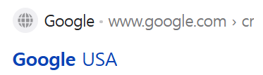

## 가상 선택자와 클래스

선택자는 **'무엇인가를 선택하는 요소'** 이다. `CSS에서 선택자는 스타일링할 특정 요소를 선택할 때 사용한다. 전체 선택자, 태그 선택자, 클래스 선택자, 아이디 선택자 외에 선택한 요소가 특별한 상태일 때 사용할 수 있는 가상 선택자를 알아보자

## 가상 선택자의 사용

가상 선택자를 어디에 사용할 수 있을까? 웹 페이지에서 버튼을 누르면 해당 버튼의 색이나 모양이 변한다. 버튼을 눌러도 아무런 변화가 없다면 버튼이 눌렸는지 안 눌렸는지 알 수 없다. 이와 같이 상태에 따라 변화를 주고 싶을 때 가상 선택자를 사용한다.

가상 선택자(pseudo selectors)
는 선택한 요소가 특별한 상태여야 만족할 수 있다. 이게 무슨 뜻인지는 두 가지로 분류해 알아보자

- 동적 가상 클래스
- 구조적 가상 클래스

## 동적 가상 클래스

동적 가상 클래스(dynamic pseudo classes)는 어떤 상태나 조건이 발생할 때, 사용자의 액션에 따라 스타일이 바뀌는 선택자이다. 버튼을 클릭했을 때 색깔이 변하는 것처럼 사용자와 웹 페이지간의 상호작용이 필요할 때 사용한다. 대표적인 동적 가상 클래스는 `active`, `visited`, `disabled`, `hover`, `focus` 이다.

## 액션이 필요해 : active

`active`는 클릭 시 활성화되는 가상 클래스이다. 예를 들어 버튼을 누르면 `active` 가상 클래스가 활성화되어서 선택한 항목에 선언한 CSS 스타일이 적용된다.

```css
<style>
  a:active { <!-- 적용 대상 태그 a와 가상 선택자 active -->
    color : red
  }
</style>
```

`button` 태그를 사용하여 클릭할 때 텍스트 색이 바뀌는 코드를 작성하고, `active` 가상 클래스를 사용해 마우스로 버튼을 누를 때 연두색으로 변경해보자.

```css
<style>
  button:active {
    color: lime;
  }
</style>
<button>클릭버튼</button>
```

클릭 전


클릭 시


## 방문 기록을 남기는 : visited

`visited` 가상 클래스는 사용자가 이미 방문한 링크를 표시해준다.

이미 `visited` 가상 클래스는 일상에서 많이 보았다. 검색창에 검색 후 특정 페이지를 들어갔다 나오면 클릭한 페이지의 텍스트 색깔이 바뀐다. 이유는 링크를 클릭하거나 방문할 때 `visited`로 표시되기 때문


방문 전 링크 




방문 후 링크


```css
<style>
  a:visited { <!--적용 대상 태그 a와 가상 선택자 visited-->
      color: coral;
  }
</style>

<body>
  <a href="https://www.google.com/">Google Website</a>
</body>
```

방문 전 방문 후


## 비활성화 : disabled

`disabled` 가상 클래스는 비활성화된 요소를 나타낸다. 말 그대로 요소를 비활성화 시킨다.

```css
<style>
  input:disabled { /*적용 대상 태그 input과 가상 선택자 disabled*/
    background: red /*적용하려는 스타일*/
    
  }
</style>
```

활용을 해보자 `input` 태그를 사용하여 입력 폼을 만든 뒤 `disabled`를 사용하여 폼을 비활성화 

```css
<style>
  input:disabled {
    background: coral;
  }
</style>

<body>
  <input type="text" placeholder="Name" disabled>
</body>
```

- `input` 태그를 이용하여 텍스트 폼을 작성하였지만 폼을 `disabled` 상태로 바꿔서 입력폼에 아무것도 쓸 수 없다. 

- 보통 `disabled`는 단독으로 쓰이기보단 조건을 추가해 조건에 해당하지 않는 경우 폼에 입력을 할 수 없도록 만드는 용도로 사용된다.


## 마우스로 상호작용 : hover