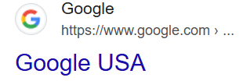
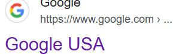
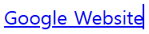

## 가상 선택자와 클래스

선택자는 **'무엇인가를 선택하는 요소'** 이다. `CSS`에서 **선택자**는 스타일링할 특정 요소를
 선택할 때 사용한다. **전체 선택자, 태그 선택자, 클래스 선택자, 아이디 선택자** 외에
선택한 요소가 **특별한 상태**일 때 사용할 수 있는 가상 선택자를 알아보자

## 가상 선택자의 사용

**가상 선택자**를 어디에 사용할 수 있을까? 웹 페이지에서 버튼을 누르면 해당 버튼의 색이나
모양이 변한다. 버튼을 눌러도 아무런 변화가 없다면 버튼이 눌렸는지 안 눌렸는지 알 수 없다.
이와 같이 **상태에 따라 변화**를 주고 싶을 때 **가상 선택자**를 사용한다.

**가상 선택자**(pseudo selectors)는 선택한 요소가 **특별한 상태**여야 만족할 수 있다. 이게 무슨 뜻인지는 두 가지로 분류해 알아보자

- **동적 가상 클래스**
- **구조적 가상 클래스**

## 동적 가상 클래스

**동적 가상 클래스**(dynamic pseudo classes)는 어떤 상태나 조건이 발생할 때,
사용자의 액션에 따라 스타일이 바뀌는 선택자이다.
버튼을 클릭했을 때 색깔이 변하는 것처럼 사용자와 웹 페이지간의 상호작용이 필요할 때
사용한다. 대표적인 동적 가상 클래스는 `active`, `visited`, `disabled`, `hover`, `focus` 이다.

## 액션이 필요해 : active

`active`는 클릭 시 활성화되는 가상 클래스이다. 예를 들어 버튼을 누르면 `active` 가상 클래스가 활성화되어서 선택한 항목에 선언한 CSS 스타일이 적용된다.

```css
<style>
  a:active { /*적용 대상 태그 a와 가상 선택자 active*/
    color : red
  }
</style>
```

`button` 태그를 사용하여 클릭할 때 텍스트 색이 바뀌는 코드를 작성하고, `active` 가상 클래스를 사용해 마우스로 버튼을 누를 때 연두색으로 변경해보자.

```css
<style>
  button:active {
    color: lime;
  }
</style>
<button>클릭버튼</button>
```

클릭 전


클릭 시


## 방문 기록을 남기는 : visited

`visited` 가상 클래스는 **사용자가 이미 방문한 링크**를 표시해준다.

이미 `visited` 가상 클래스는 일상에서 많이 보았는데, 검색창에 검색 후 특정 페이지를 들어갔다
나오면 **클릭한 페이지의 텍스트 색깔**이 바뀐다. 이유는 링크를 클릭하거나 방문할 때 `visited`로 표시되기 때문이다.


- 자세한 이유를 알아보았을 때, 웹에서 `visited` 가상 클래스가 자동으로 적용되는 이유는 **브라우저가 사용자의 방문 기록을 저장하고
이를 기반으로 스타일을 적용하기 때문이다.**

- 브라우저는 방문한 링크의 URL을 저장하고, 해당 URL과 동일한 링크가 페이지에 있으면
CSS에서 정의된 `:visited` 스타일을 적용한다. 하지만 보안상의 이유로 `visited` 상태의 요소에는 **생상 및 몇 가지 스타일만 적용 가능**하고,
자바스크립트로 `visited` 여부를 직접 감지하는 것은 제한되어 있다.


방문 전 링크 




방문 후 링크




```css
<style>
  a:visited { /*적용 대상 태그 a와 가상 선택자 visited*/
      color: coral;
  }
</style>

<body>
  <a href="https://www.google.com/">Google Website</a>
</body>
```

방문 전



 방문 후
 
 


## 비활성화 : disabled

`disabled` 가상 클래스는 비활성화된 요소를 나타낸다. 말 그대로 **요소**를 **비활성화** 시킨다.

```css
<style>
  input:disabled { /*적용 대상 태그 input과 가상 선택자 disabled*/
    background: red /*적용하려는 스타일*/
    
  }
</style>
```

활용을 해보자 `input` 태그를 사용하여 입력 폼을 만든 뒤 `disabled`를 사용하여 **폼을 비활성화** 

```css
<style>
  input:disabled {
    background: coral;
  }
</style>

<body>
  <input type="text" placeholder="Name" disabled>
</body>
```

- `input` 태그를 이용하여 텍스트 폼을 작성하였지만 폼을 `disabled` 상태로 바꿔서 입력폼에 아무것도 쓸 수 없다. 

- 보통 `disabled`는 단독으로 쓰이기보단 조건을 추가해 조건에 해당하지 않는 경우 폼에 입력을 할 수 없도록 만드는 용도로 사용된다.


## 마우스로 상호작용 : hover

`hover` 가상 클래스는 **마우스 커서를 요소에 올려놓았을 때** 선언한 스타일을 실행한다.
 `active`가 클릭할 때 반응하는 거라면 `hover`는 마우스를 올려놓았을 때 반응한다. 
 **마우스의 움직임만으로 동적인 모습**을 표현할 수 있어서 좋다.

 ```css
 <style>
  a:hover {
    color: orange;
  }
 </style>
 ```

 ### 주의점

 `hover` 가상 클래스 특징
  1. 스마트폰 같은 터치스크린에서 작동하지 않거나.
  2. 요소를 터치한 후 잠시 동안만 작용하거나,
  3. 사용자가 터치를 하지 않아도 다른 요소를 터치할 때까지 계속 작동할 수 있다. `hover` 기능을 사용할 때는 유저들이
  사용하는 모든 장치에서 의도한 대로 보이는지 확인해야 한다.


  ```css
  <style>
    span {
      background-color: blue;
    }
    span:hover {
      background-color: gold;
    }
  </style>

  <body>
    <span>마우스를 올려두는 곳</span>
  </body>
  ```

- 마우스 올리기 전 기본 상태


- 마우스 올린 후


## 클릭하면 반응하는 focus

`focus`는 `input`으로 만든 폼 등 **집중(focus)을 받은 요소**를 나타낸다. PC에서는 마우스 클릭이나 **tab** 키를 클릭할 때, 스마트폰에서는 탭을 했을 때 발동한다.

```css
<style>
  input:focus {
    color:red;
  }
</style>

```css
<style>
  .red-input:focus {
    background: springgreen;
    color: red;
  }

  .blue-input:focus {
    background: springgreen;
    color: blue;
  }
</style>

<body>
  <input class="red-input" value="클릭하면 빨갛게 변경" />
  <input class="blue-input" value="클릭하면 파랗게 변경" />
</body>
```

클릭했을 때 빨갛게 변경


클릭했을 때 파랗게 변경


## 구조적 가상 클래스 