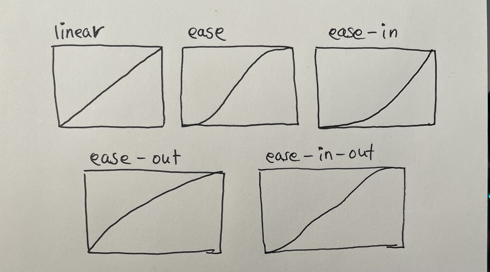
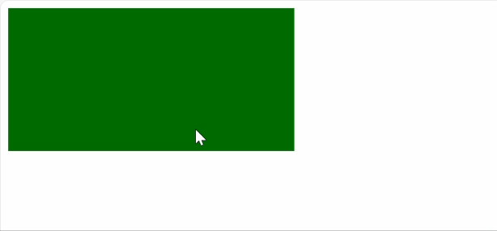
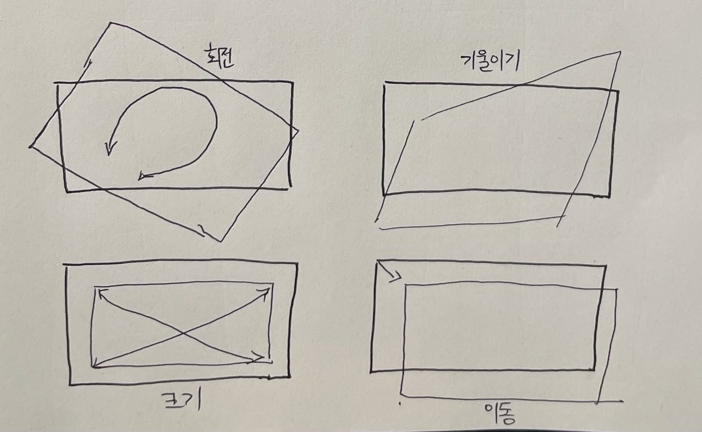
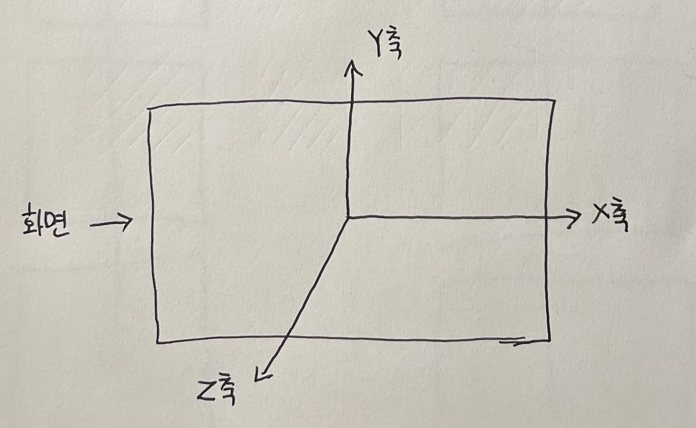
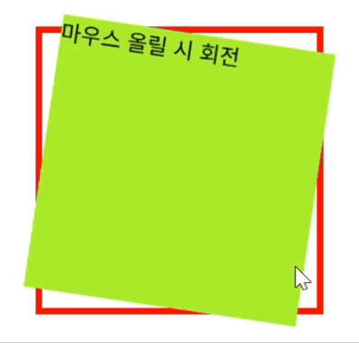
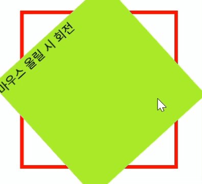
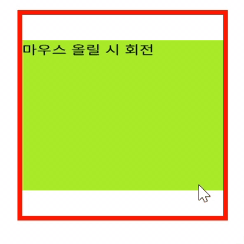

# CSS 애니메이션

`CSS`에서 애니메이션이란 움직이는(변화하는) 효과를 의미한다. 예를 들어 CSS 애니메이션으로 요소의 스타일(글자 색, 이미지 위치 등)에 변화를 줄 수 있다. `CSS`에서는 전환, 변형, 키프레임으로 애니메이션을 구현한다. 즉, 내가 만드는 웹, 앱 페이지에 움직임을 줄 수 있다.


# 전환

**전환(transition)**  은 시간에 따른 상태를 지정하는 애니메이션이다. 대표적인 장점은 형태의 변형을 부드럽게 만들어준다는 점이다. 즉, 부드럽고 점진적인 애니메이션을 만들려면 움직임을 줄 때 전환을 사용해야 한다.

 예를 들어서 `hover` 상태에서 배경색을 바꿀 때 아무 설정이 없다면 색이 갑자기 바뀐다. 하지만 전환을 사용하면 색이 서서히 바뀌면서 사용자에게 더 좋은 경험을 줄 수 있다.


전환에는 2가지의 필수 속성과 2가지의 선택 속성이 있다.

- `필수 속성`
   - **전환 속성값(transition-property)**
   - **전환 시간(transition-duration)**

- `선택 속성`
  - **전환 타이밍(tran\ition-timing-function)**
  - **전환 지연(transition-delay)**


# 전환 속성값

**전환 속성값(transition-property)** 은 전환될 속성을 지정한다. 전환 속성값에는 `border-color`와 같은 개별 속성 또는 **all(전체 속성)** 이 있다. 전체를 지정하면 모든 속성에, 개별 속성을 지정하면 지정한 개별 속성에 애니메이션이 적용된다.


```css
element {
  transition-property: border-color;
  transition-property: all;
}
```

# 전환 시간

전환 시간(transition-duration)은 전환을 시작해서 끝날 때까지의 시간을 지정한다. 초(s) 또는 밀리초(ms)로 지정한다. 기본값은 0초이고 어떠한 애니메이션도 일어나지 않는다는 의미이다. 따라서 부드러운 애니메이션을 주려면 전환 시간을 반드시 입력해야 한다.

```css
element {
  transition-duration: 0.5s;
}
```


# 전환 타이밍
전환 타이밍(transition-timing-function)은 전환이 이루어지는 시점을 지정한다. 다른 말로는 변화하는 속도의 곡선을 조절한다.

```css
element {
  transition-timing-function: ease-in;
}
```

전환 타이밍 속성값으로는 `linear`, `ease-in`, `ease-out`, `ease-in-out`, `step-start`, `step-end`등이 있는데, 기본값은 `ease`이다.



자세한 건 구글에 **css animation transition-timing-function**으로 검색하자

# 전환 지연

전환 지연(transition-delay)은 전환을 지연시켜서 전환이 시작되는 시기를 지정한다. 전환은 조건이 충족되는 즉시 진행된다. 하지만 전환 지연을 사용해서 전환을 지연시킬 수 있다. 
쉽게 얘기하면 언제부터 애니메이션을 시작할지 지연 시간을 설정하는것이다.

```css
element {
  transition-delay: 1s;
}
```


# 테스트 코드

마우스를 사각형 위에 올려두면 색이 변하는 코드를 작성해보자

```html
<style>
  div {
    background: blueviolet;
    width: 300px;
    height: 150px;
    transition-timing-function: linear; /* 1 */
    transition-duration: 300ms; /* 2 */
}
div:hover {
    background: green;
}
</style>

<body>
  <div></div>
</body>
```

각 속성을 개별적으로 작성할 수 있지만 더 빠르고 깔끔한 코드를 작성한다면 코드 1번,2번을 합쳐서 
`transition: background 500ms linear;` 로 작성할 수 있다.





# 변형

**변형(transform)** CSS 속성을 사용하면 외적인 형태의 변형을 줄 수 있다. 또한 전환과 함께 사용하면 부드러운 애니메이션을 만들 수 있는데, **회전(rotate), 기울이기(skew), 크기(scale), 이동(translate)** 등이 있다.



공간에 대한 이해가 필요한데, 모든 변형은 세 축(X, Y, Z)을 중심으로 이루어진다. 어느 방향으로 움직이는지 파악하면서 변형을 사용해야 한다.

- X축은 왼쪽에서 오른쪽으로 이동/변형되며 값은 오른쪽으로 증가한다.
- Y축은 아래에서 위쪽으로 이동/변형되며 값은 위쪽으로 증가한다.
- Z축은 화면에서 튀어 나와 더 큰 값이 화면에 더 가깝다.

아래는 세 축을 표현한 그림이다.




# 회전

**회전(rotate)** 은 지정된 각도(단위는 deg)만큼 요소를 시계 방향 or 반시계 방향으로 회전시킨다. 양수는 시계방향으로, 음수는 시계 반대 방향으로 회전한다.


```css
div {
    width: 200px;
    height: 200px;
}

.container {
    border: 5px solid red;
    margin: 50px;
}

.transformed {
    background-color: greenyellow;
    transition: transform 1s ease-in-out;
}

.transformed:hover {
    transform: rotate(45deg);
}
```
```html
<body>
    <div class="container">
        <div class="transformed">마우스 올릴 시 회전</div>
        </div>
</body>
```




# rotate에 따른 변화

- **rotate(-45deg);**



- **rotateX(45deg);**




- **rotateY(45deg);**

