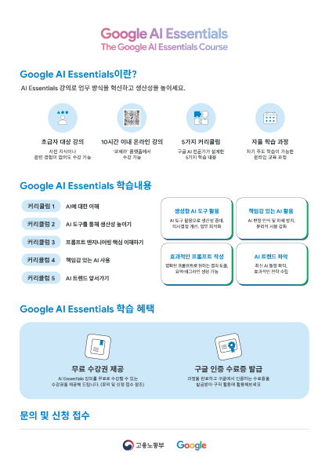

Google AI Essentials 특화 과정

Google AI Essentials는 다양한 직무와 업종에서 수요가 많은 AI 기술을 습득하여 역량을 강화하고 생산성을 향상하고자 하는 전문가를 위해 설계된 자기 주도형 학습 프로그램이다.

이 학습 프로그램은 모두에게 유용한 기술을 만들기 위해 노력하는 Google의 AI 전문가가 진행한다. 이 전문가들이 업무 환경에서 AI의 실제 적용 사례를 통해 얻은 지식과 인사이트를 공유한다. 

이 학습 프로그램을 통해 AI 도구를 실습해 보는 귀중한 실무 경험을 쌓고, AI를 활용하여 일상의 업무 흐름을 탁월하게 혁신하는 강력한 방법을 발견할 수 있다.

# 수강 배경
업무 자동화와 `AI`도구 활용에 관심이 많았고, Google의 공식 입문 강의라는 점에서 신뢰감을 느껴 신청하게 되었다. 특히 **직무 생산성 향상**이라는 키워드가 현재 커리어 방향성과 맞닿아 있어 더욱 끌렸다.

## 과정 진행

1. AI 소개

2. AI 도구로 생산성 극대화하기

3. 프롬포팅 기법 알아보기

4. AI를 책임감 있게 사용하기

5. AI 시대에 앞서 나가기

# 수강하면서 얻은 인사이트

- `AI`는 도구일 뿐, 핵심은 인간 중심의 문제 해결이다.
   - 강의에서는 단순히 AI 도구를 소개하는 데 그치지 않고, 어떤 문제를 해결할 때 왜 AI가 적절한 수단이 되는지를 설명해준다. 도구 사용법도 중요하지만 **왜 사용하는가**에 대한 관점을 먼저 알려준 점이 인상 깊었다.

- 프롬포트 작성은 창의적 사고의 훈련이다.
   - 단순한 명령이 입력이 아닌, 원하는 결과를 얻기 위한 질문 설계법을 학습하면서 '프롬포트 디자인'이라는 분야의 중요성을 느꼈다.

- AI를 '책임감 있게 사용하는 법'에 대한 고민도 필수적이다.
  - 편향, 개인정보, 투명성 등 AI 윤리에 대한 고민도 구체적으로 다뤄졌고, 이 부분이 AI 리터러시의 핵심임을 깨달았다.

# 실무에 어떻게 활용할까
- 회의록 자동 요약, 고객 응대 이메일 초안 작성, 코드 리팩토링 등 AI 도구를 통한 반복 업무 절감 가능성 탐색
- 프롬포트 설계 능력을 바탕으로 정확한 인사이트를 뽑아내는 실전 훈련에 자신감 향상
- 윤리적 AI 사용 기준을 업무 정책이나 커뮤니케이션에 적용하는 디지털 책임감 강화

# Result

이 강의를 통해 단순히 '도구를 잘 쓰는 사람'을 넘어서 AI를 왜 쓰는지 알고 방향을 설계할 수 있는 사람이 되는 것이 중요하다는 걸 깨달았다.

Google AI Essentials는 AI 시대의 기본 교양이자 실무 도구 사용 능력을 기를 수 있는 출발점이다. AI와 인간의 협업을 고민하는 철학적 출발선에 가깝다는 생각이 들었다.

