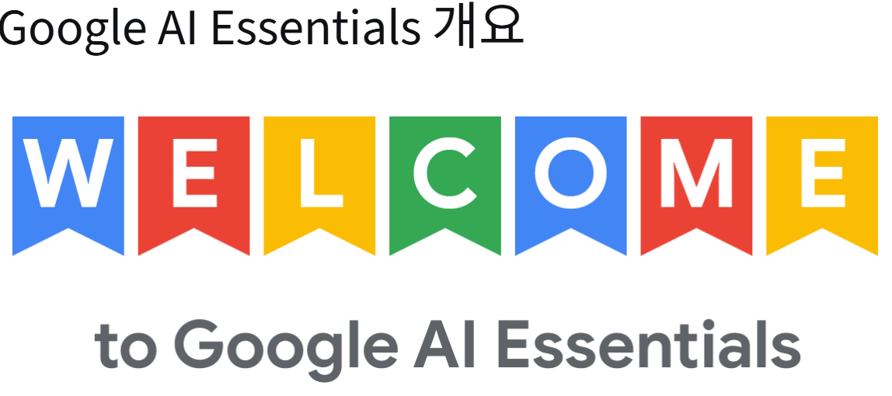

Google AI Essentials 특화 과정

Google AI Essentials는 다양한 직무와 업종에서 수요가 많은 AI 기술을 습득하여 역량을 강화하고 생산성을 향상하고자 하는 전문가를 위해 설계된 자기 주도형 학습 프로그램이다.

이 학습 프로그램은 모두에게 유용한 기술을 만들기 위해 노력하는 Google의 AI 전문가가 진행한다. 이 전문가들이 업무 환경에서 AI의 실제 적용 사례를 통해 얻은 지식과 인사이트를 공유한다. 

이 학습 프로그램을 통해 AI 도구를 실습해 보는 귀중한 실무 경험을 쌓고, AI를 활용하여 일상의 업무 흐름을 탁월하게 혁신하는 강력한 방법을 발견할 수 있다.

## 과정 진행

1. AI 소개

2. AI 도구로 생산성 극대화하기

3. 프롬포팅 기법 알아보기

4. AI를 책임감 있게 사용하기

5. AI 시대에 앞서 나가기

## 코스 콘텐츠

5개의 강좌는 각각 다음과 같은 유형의 콘텐츠로 구성되어 있다.

- 학습 영상: Google AI 전문가가 새로운 개념과 지침을 전달한다.
- 읽기자료: 학습 영상에서 배운 개념을 바탕으로 새로운 아이디어를 소개한다.
- 활동: AI를 사용하여 학습한 스킬을 적용하고 실습한다.
-평가 퀴즈: 학습 진행 상황을 측정하고 유용한 피드백을 제공한다. 필요한 경우 80%이상의 합격 점수를 획득할 때까지 여러 번 평가 퀴즈에 응시할 수 있다.

이 과정을 완료하면 소셜 네트워크에 공유하거나 이력서에 추가할 수 있는 Google 인증서를 받게 된다.