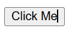
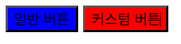
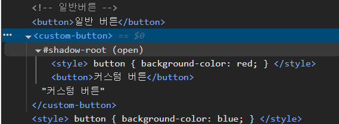

# 웹 컴포넌트(WEB Components)란?


**웹 컴포넌트(Web Components)** 는 웹 사이트, 웹 내에서 사용할 새로운 **사용자 정의요소(custom element)** 를 생성하는 웹 플랫폼 API 세트이다. 사용자가 정의한 **HTML 구조, CSS 스타일, JavaScript**로직 등을 설계하고 등록하면 웹 애플리케이션에서 커스텀 요소를 사용할 수 있다.

멋쟁이사자처럼 `JS` 수업에서 학습한 내용을 바탕으로 내가 쉽게 이야기를 풀어가자면,

# 도시락 반찬으로 비유

도시락 가게에서 매일 점심 도시락을 만든다고 가정하자. 도시락에는 주로 밥, 계란말이, 김치, 고기 등 같은 반찬이 들어간다.

그런데 매번 도시락을 만들 때마다 재료를 하나하나 썰고, 볶고, 간 맞추고... **똑같은 반찬을 매번 처음부터 만든다고 극단적으로 생각하면** 엄청 비효율적이고 실수도 생긴다.

그래서 가게에서 반찬을 **미리 만들어서 보관**해두기로 했다. 도시락을 만들 때, 필요한 반찬만 꺼내서 도시락에 넣기만 하면 되니까 **더 빠르고 정확하게 도시락을 만들 수 있는거다.**

- 웹 컴포넌트는 말 그대로 **'웹에서 내가 직접 만든 부품'을 만들어서 쓰는 기술**이다.

# 웹 컴포넌트도 비슷하다.

웹 사이트도 마찬가지이다.

예를 들어, 어떤 페이지에서 자주 쓰는 '버튼'이 있다고 가정하자

- 어떤 버튼은 빨간색이고
- 어떤 버튼은 클릭했을 때 알림이 뜨고,
- 어떤 버튼은 애니메이션도 있다.

근데 이걸 **페이지마다 매번 새로 만들다 보면,** 코드가 중복되고 **어느 한 곳에서 수정이 생기면 모든 버튼을 일일이 고쳐야 하는 번거로움**이 생긴다. 

이럴 때, **웹 컴포넌트 `my-button` 이라는 내 버튼을 한 번 만들어 두면**, 필요한 곳에 `<my-button></my-button>` 만 적으면 되니까, 도시락 반찬처럼 **빠르고 안정적으로 UI를 조립할 수 있는것이다.**


# ✨ 웹 컴포넌트를 써야 하는 이유, 정리하면?

| 이유    | 일상 비유                  | 개발 상황                      |
| ----- | ---------------------- | -------------------------- |
| **재사용성**  | 반찬을 미리 만들어놓고 도시락에 담는 것 | 한 번 만든 버튼을 여러 페이지에서 반복 사용  |
| **유지보수**  | 반찬 간이 짜면 반찬통 하나만 바꾸면 됨 | 스타일을 고칠 땐 컴포넌트 코드 하나만 수정   |
| **충돌 방지** | 반찬끼리 섞이지 않도록 칸막이 도시락   | 스타일이 섞이지 않도록 Shadow DOM 사용 |


# 📌 웹 컴포넌트 기술 구성

## **1. Custom Elements**

### 🍱Custom Elements 음식으로 비유하면?
매번 요리를 처음부터 만들기 귀찮아서. 자주 쓰는 레시피를 미리 `<my-button></my-button>` 이라는 **세트**로 만들어두면 좋지 않을까?

웹 개발에서도 반복되는 UI 요소들이 있기 때문에 매번 `HTML`, `CSS`, `JS`를 **일일이 다시 쓰는 대신**, 하나의 **세트(Custom Element)** 로 만들어둔다. 그럼 `<my-button>` 하나만 쓰면, 안에 레시피(버튼 구조, 스타일, 동작)이 다 들어있는 것이다.

HTML 태그처럼 보이지만, 내가 직접 만든 태그를 사용할 수 있다. 예를 들어 `<my-button>`이라는 나만의 버튼을 만들 수 있다.

```js
class MyButton extends HTMLElement {
  constructor() {
    super();
    this.innerHTML = '<button>Click Me</button>';
  }
}

customElements.define('my-button', MyButton);
```

```html
<!DOCTYPE html>
<html lang="ko">
<head>
  <meta charset="UTF-8" />
  <meta name="viewport" content="width=device-width, initial-scale=1.0" />
  <title>Custom Element Test</title>
  <script src="index.js" defer></script>
</head>
<body>
  <!-- 사용자 정의 요소 -->
  <my-button></my-button>
</body>
</html>
```


이제 `HTML`에서 `<my-button></my-button>`를 쓰면, 위에서 정의한 버튼이 나타나게 된다. 그냥 편한 게 아니라, 이걸 통해 **HTML 태그의 기능을 확장하거나 완전히 새로 만들 수도 있다.**

### Custom Elements 핵심

| 반복 요리          | Custom Elements    |
| -------------- | ------------------ |
| 매번 라면을 처음부터 끓임 | 요리 세트로 준비해서 바로 사용  |
| 재사용 불편         | 한 번 만들면 어디서든 사용 가능 |
| 중복 코드 많음       | 코드 관리 간편 & 유지보수 쉬움 |


## **2. Shadow DOM**

한 페이지에 여러 요소가 있을 때, 스타일이 서로 섞여 버리는 경험이 있을것이다. 예를 들어, 파란 버튼이 기본인데 어떤 상황에서는 빨간 버튼도 필요할 때가 있다.

그럴 때 **Shadow DOM**을 사용한다.

### 🍱Shadow DOM 음식으로 비유하면?

각각 메뉴를 다른 접시간 아닌, **한 접시**에 **김치볶음밥**과 **초코케이크**를 같이 담았다고 가정하자.

- 볶음밥의 고추기름이 초코케이크에 묻고,
- 케이크의 달콤한 초콜릿이 밥알에 묻는다.
- 결국 두 음식이 맛이 섞이고 망가져버린다.

이게 바로 `스타일충돌`이다. 한 페이지에서 여러 UI 요소의 CSS가 서로 영향을 주면, 예상하지 못한 결과가 생길 수 있다.

### 🍱해결법 : "음식을 도시락 칸에 나눠 담기"

이제 **도시락**을 떠올려보자.

- 김치볶음밥은 **왼쪽 칸**
- 초코케이크는 **오른쪽 칸**에 딱 나뉘어 있다.

기름도, 단맛도 서로 섞이지 않고 **각자의 맛을 유지**한다.

이게 바로 **Shadow DOM**이다. 웹 컴포넌트 하나하나에 **자기만의 칸막이(공간)**을 만들어서 **자신의 스타일과 구조를 안전하게 보호**하는 것이다.


```html
<!-- 일반 버튼 -->
 <button>일반 버튼</button>

<!-- 커스텀 버튼 -->
<custom-button>커스텀 버튼</custom-button>

<style>
  button {
    background-color: blue;
  }
</style>
```

```js
class CustomButton extends HTMLElement {
  constructor() {
    super();
    const shadow = this.attachShadow({ mode: 'open' });
    shadow.innerHTML = `
      <style>
        button {
          background-color: red;
        }
      </style>
      <button>커스텀 버튼</button>
    `;
  }
}
customElements.define('custom-button', CustomButton);
```





- **전역에서 모든 `button` 태그의 스타일을 파란색으로 지정**하고,
- `커스텀 버튼`에서는 **Shadow DOM으로 감싸서 그 안의 `button`만 빨간색으로 따로 지정**했다.
- `개발자 도구(F12)`를 통해 `커스텀 버튼`에 **Shadow DOM**이 적용된 걸 확인할 수 있다.

두 버튼이 같은 페이지에 존재해도 서로의 스타일이 섞이지 않고,
각각 자기만의 공간(쉐도우 돔)을 가지고 있는 것이다.


### Shadow 핵심

| 일반 DOM        | Shadow DOM     |
| ------------- | -------------- |
| 음식이 같은 접시에 섞임 | 각자 도시락 칸에 담김   |
| CSS 스타일 충돌 가능 | 독립된 스타일 유지 가능  |
| 유지 보수 어려움     | 컴포넌트 단위로 관리 쉬움 |


## 3. **HTML Template**

### 🍱HTML Template, 음식으로 비유하면?

매일 도시락을 직접 요리해서 만든다고 가정하자.

밥 짓고, 반찬하고, 도시락 통에 담고.. 이걸 매번 반복하면 시간도 에너지 소모도 크다.

그래서 나는 이렇게 한다.
- 미리 도시락을 여러 개 만들어서 냉장고에 넣어둔다.
- 배고플 때마다 꺼내서 데워서 먹기만 하면 된다.

즉, **필요할 때 꺼내 쓸 수 있도록 준비된 상태**인 것이다.

### 🍱 이게 바로 `<template>` 이다.

`HTML`에서도 자주 쓰는 구조(카드, 알림 메시지, 목록 아이템 등)을 **미리 숨겨진 상태로** 만들어 두고,

**"지금 당장은 필요 없지만(배가 안고프지만), 필요해지면(배고프면) `JavaScript`** 로 꺼내서(전자레인지에 데워서) 화면에 보여줄거야(먹을거야)

즉, **재사용 가능한 콘텐츠 구조를 미리 정의** 해 놓고, 필요할 때마다 사용할 수 있는 기능이다. 템플릿은 처음 페이지가 로드될때는 화면에 나타나지 않지만, `JavaScript`로 활성화시키면 **동적으로** 화면에 추가된다.

```html
<template id="food-card">
<div class="card">
  <h2>도시락 메뉴</h2>
  <P>밥, 계란말이, 김치</P>
</div>
</template>
```
위 코드는 `HTML`안에 있지만, **바로 화면에 나타나진 않는다.**
`JavaScript`가 꺼내서 화면에 붙일 때만 보여진다.


```js
const template = document.getElementById('food-card');
const clone = template.content.cloneNode(true);
document.body.appendChild(clone);
```

### HTML Template 핵심

| 도시락 비유       | HTML Template         |
| ------------ | --------------------- |
| 미리 만들어둔 도시락  | `<template>` 태그 안의 구조 |
| 냉장고에 숨겨져 있음  | DOM에 있지만 보이지 않음       |
| 필요할 때 꺼내서 데움 | JS로 꺼내서 화면에 삽입        |
| 효율적, 빠른 식사   | 재사용 가능, 렌더링 효율 ↑      |
