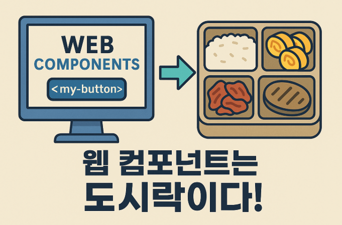

# 웹 컴포넌트(WEB Components)란?

**웹 컴포넌트(Web Components)** 는 웹 사이트, 웹 내에서 사용할 새로운 사용자 정의요소(custom element)를 생성하는 웹 플랫폼 API 세트이다. 사용자가 정의한 HTML 구조, CSS 스타일, JavaScript 로직 등을 설계하고 등록하면 웹 애플리케이션에서 커스텀 요소를 사용할 수 있다.

멋쟁이사자처럼 `JS` 수업에서 학습한 내용을 바탕으로 내가 쉽게 이야기를 풀어가자면,

# 도시락 반찬으로 비유

도시락 가게에서 매일 점심 도시락을 만든다고 가정하자. 도시락에는 주로 밥, 계란말이, 김치, 고기 등 같은 반찬이 들어간다.

그런데 매번 도시락을 만들 때마다 재료를 하나하나 썰고, 볶고, 간 맞추고... **똑같은 반찬을 매번 처음부터 만든다고 극단적으로 생각하면** 엄청 비효율적이고 실수도 생긴다.

그래서 가게에서 반찬을 **미리 만들어서 보관**해두기로 했다. 도시락을 만들 때, 필요한 반찬만 꺼내서 도시락에 넣기만 하면 되니까 **더 빠르고 정확하게 도시락을 만들 수 있는거다.**

- 웹 컴포넌트는 말 그대로 **'웹에서 내가 직접 만든 부품'을 만들어서 쓰는 기술**이다.

# 웹 컴포넌트도 비슷하다.

웹 사이트도 마찬가지이다.

예를 들어, 어떤 페이지에서 자주 쓰는 '버튼'이 있다고 가정하자

- 어떤 버튼은 빨간색이고
- 어떤 버튼은 클릭했을 때 알림이 뜨고,
- 어떤 버튼은 애니메이션도 있다.

근데 이걸 **페이지마다 매번 새로 만들다 보면,** 코드가 중복되고 **어느 한 곳에서 수정이 생기면 모든 버튼을 일일이 고쳐야 하는 번거로움**이 생긴다. 

이럴 때, **웹 컴포넌트 `my-button` 이라는 내 버튼을 한 번 만들어 두면**, 필요한 곳에 `<my-button></my-button>` 만 적으면 되니까, 도시락 반찬처럼 **빠르고 안정적으로 UI를 조립할 수 있는것이다.**

# ✨ 웹 컴포넌트를 써야 하는 이유, 정리하면?

| 이유    | 일상 비유                  | 개발 상황                      |
| ----- | ---------------------- | -------------------------- |
| **재사용성**  | 반찬을 미리 만들어놓고 도시락에 담는 것 | 한 번 만든 버튼을 여러 페이지에서 반복 사용  |
| **유지보수**  | 반찬 간이 짜면 반찬통 하나만 바꾸면 됨 | 스타일을 고칠 땐 컴포넌트 코드 하나만 수정   |
| **충돌 방지** | 반찬끼리 섞이지 않도록 칸막이 도시락   | 스타일이 섞이지 않도록 Shadow DOM 사용 |
