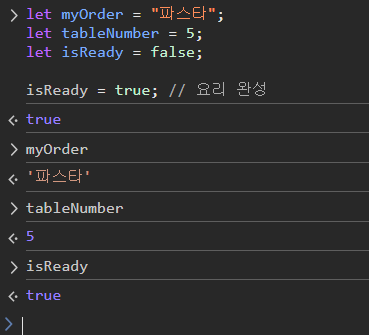

# JavaScript

자바스크립트를 처음 접하는 사람들을 위해, 또는 **"문법부터 차근차근 배워야 하나?"** 라고 고민 하는 사람들을 위해 이렇게 말하고 싶다.

**"김치볶음밥을 잘 만들고 싶다고 해서 쌀의 품종부터 공부할 필요는 없다"**

쌀은 밥 짓다 보면 자연스럽게 배우는 거고, **진짜 중요한 건 "맛있게 먹히는 요리"를 만드는 것이다.**

웹 개발도 마찬가지이다. **변수, 자료형, 연산자** 같은 기본기야 당연히 중요하지만, 처음부터 문법만 주구장창 학습하면 재미가 없다. 그래서 나는 최소한의 문법을 학습하고, **직접 웹이 '움직이는 걸 먼저 경험하고' 그 원리를 하나씩 짚어나가는 방식(조금씩 구현해 나가면서)** 을 추천한다. 


**JavaScirpt(자바스크립트)** 는 웹 페이지를 **동적이고 상호작용**할 수 있게 만들어주는 프로그래밍 언어이다. `HTML`이 웹 페이지의 구조를 만들고, `CSS`가 디자인을 담당한다면, `JavaScirpt`는 **웹 페이지에 생명을 불어넣는 역할**을 한다.


# 자바스크립트는 웹의 '요리사' 같은 존재이다.

웹 사이트를 도시락에 비유하면, 
- `HTML`은 도시락의 **뼈대와 칸막이** (어떤 반찬이 어디에 들어갈지 구조를 정해주는 역할)

- `CSS`는 **반찬의 색깔과 포장지** (보기 좋게, 먹음직스럽게 꾸며주는 역할)

- `JS`는 "**반찬 데우기, 간 조절, 알람 설정"** 같은 **동적인 행동**을 담당하는 요리사


# 레스토랑으로 비유해보자

어떤 고급 레스토랑에 갔다고 가정하자.

- **HTML**: 레스토랑의 **건물 구조**

→ 테이블, 의자, 주방, 화장실 등 구조를 만드는 설계도

- **CSS**: 레스토랑의 **인테리어**

→ 테이블보 색깔, 조명 분위기, 벽지 패턴 등 디자인 요소

그런데 이것만으로는 **진짜 레스토랑**이 아니다. **왜 WHY?**

- 손님이 주문해도 아무 반응이 없고
- 키오스크 메뉴판을 클릭해도 화면에 변함이 없고
- 웨이터도 없고, 요리사도 없다.

그러면 이 레스토랑은 제대로 된 공간이 아니기 때문에 필요한 것이 `JavaScript`이다.


# `JavaScript는 레스토랑의 '직원'과 '시스템'

- 손님이 버튼을 누르면 **웨이터**가 달려오고
- 메뉴를 선택하면 **주방에 주문이 들어가며**
- 결제를 하면 **계산이 처리**되고
- 예약 시스템은 **실시간으로 동작**

`JavaScript`는 웹 페이지에서 **이 모든 상호작용을 가능하게 하는 도구**이다.


# JavaScript를 써야 하는 이유
| 이유        | 레스토랑 비유               | 웹 개발 상황                     |
| --------- | --------------------- | --------------------------- |
| **상호작용**  | 손님이 주문하면 웨이터가 응답      | 버튼 클릭, 폼 제출 등의 이벤트 처리       |
| **동적 변화** | 메뉴가 시간대별로 바뀜          | 페이지 새로고침 없이 콘텐츠 업데이트        |
| **실시간**   | 요리 상태를 주방에서 실시간으로 알려줌 | 실시간 채팅, 알림, 데이터 표시 등        |
| **편의성**   | 예약부터 결제까지 한 번에 처리     | 복잡한 기능들을 부드럽게 연결 |


# JavaScript 기본 구성 요소 - 정호 레스토랑 예시시

## 1. 변수(Variables) - 주문서와 계산대

**변수, 정호 레스토랑에서는?**

정호 레스토랑에서 주문을 받으려면 **기록할 곳**이 필요하다.

- 손님이 "파스타"를 주문하면 웨이터는 **빈 그릇에 '파스타'라고 메모**를 붙인다.
- 나중에 파스타가 완성되면, **빈 그릇에 파스타**를 담는다.

`JavaScript`에서 변수도 이와 똑같다.

```js
// 빈그릇 준비하고 메모 붙히기
let myOrder = "파스타";
let tableNumber = 5;
let isReady = false;

isReady = true; // 요리 완성
```




**변수는 데이터를 담고, 저장하고, 바꾸는 상자**이다. 필요할 때마다 상자 안의 내용을 꺼내보거나 바꿀 수 있다.


## 2. 함수(Functions)

레스토랑에는 여러 **전문 직원**들이 있다.

- **요리사** : 주문표를 보고 -> 요리를 완성.
- **웨이터** : 주문을 받으면 -> 주방에 전달 -> 음식을 서빙
- **계산원** : 계산을 하고 -> 영수증을 손님에게 전달