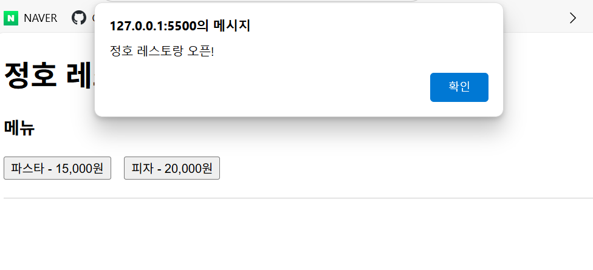
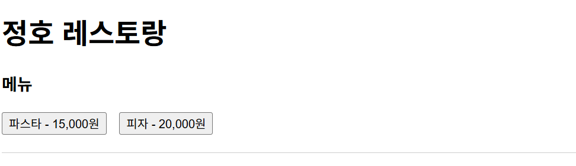
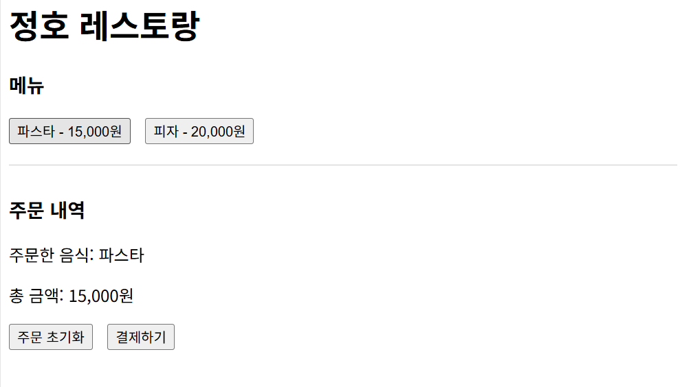
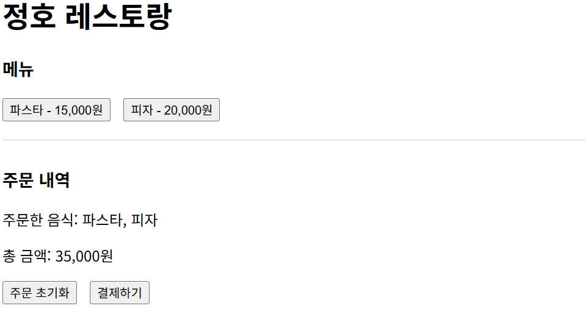
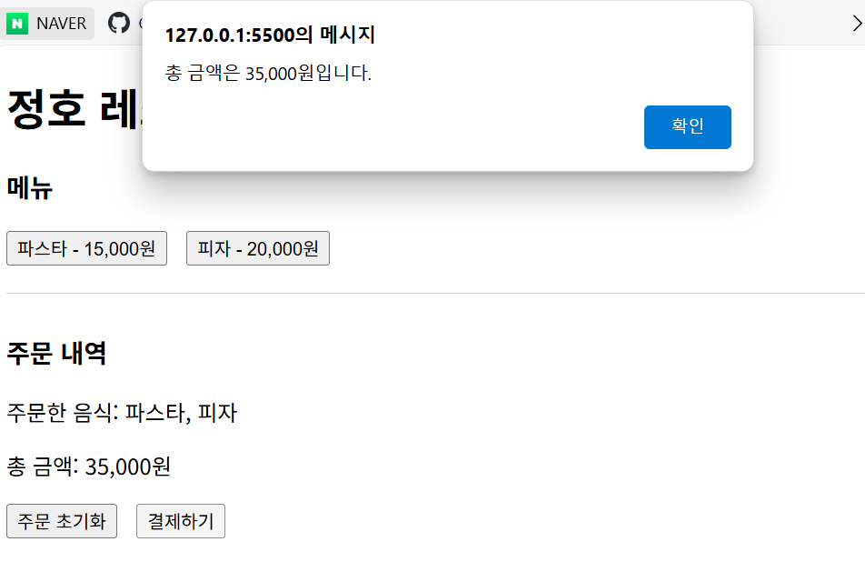
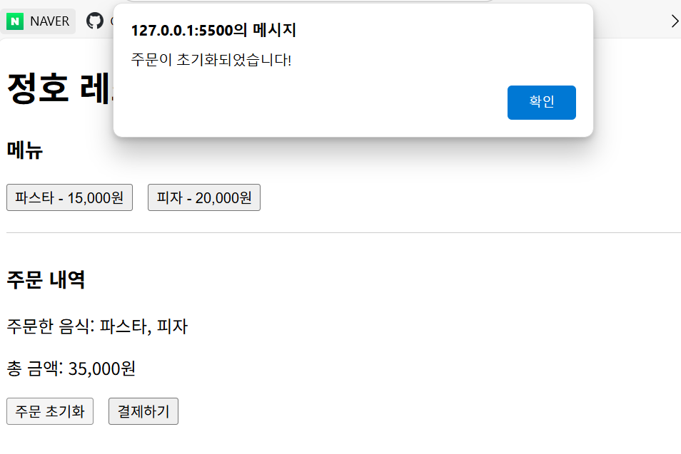

# JavaScript

자바스크립트를 처음 접하는 사람들을 위해, 또는 **"문법부터 차근차근 배워야 하나?"** 라고 고민 하는 사람들을 위해 이렇게 말하고 싶다.

**"김치볶음밥을 잘 만들고 싶다고 해서 쌀의 품종부터 공부할 필요는 없다"**

쌀은 밥 짓다 보면 자연스럽게 배우는 거고, **진짜 중요한 건 "맛있게 먹히는 요리"를 만드는 것이다.**

웹 개발도 마찬가지이다. **변수, 자료형, 연산자** 같은 기본기야 당연히 중요하지만, 처음부터 문법만 주구장창 학습하면 재미가 없다. 그래서 나는 최소한의 문법을 학습하고, **직접 웹이 '움직이는 걸 먼저 경험하고' 그 원리를 하나씩 짚어나가는 방식(조금씩 구현해 나가면서)** 을 추천한다. 


**JavaScript(자바스크립트)** 는 웹 페이지를 **동적이고 상호작용**할 수 있게 만들어주는 프로그래밍 언어이다. `HTML`이 웹 페이지의 구조를 만들고, `CSS`가 디자인을 담당한다면, `JavaScirpt`는 **웹 페이지에 생명을 불어넣는 역할**을 한다.


# 자바스크립트는 웹의 '요리사' 같은 존재이다.

웹 사이트를 도시락에 비유하면, 
- `HTML`은 도시락의 **뼈대와 칸막이** (어떤 반찬이 어디에 들어갈지 구조를 정해주는 역할)

- `CSS`는 **반찬의 색깔과 포장지** (보기 좋게, 먹음직스럽게 꾸며주는 역할)

- `JS`는 "**반찬 데우기, 간 조절, 알람 설정"** 같은 **동적인 행동**을 담당하는 요리사


# 레스토랑으로 비유해보자

어떤 고급 레스토랑에 갔다고 가정하자.

- **HTML**: 레스토랑의 **건물 구조**

→ 테이블, 의자, 주방, 화장실 등 구조를 만드는 설계도

- **CSS**: 레스토랑의 **인테리어**

→ 테이블보 색깔, 조명 분위기, 벽지 패턴 등 디자인 요소

그런데 이것만으로는 **진짜 레스토랑**이 아니다. **왜 WHY?**

- 손님이 주문해도 아무 반응이 없고
- 키오스크 메뉴판을 클릭해도 화면에 변함이 없고
- 웨이터도 없고, 요리사도 없다.

그러면 이 레스토랑은 제대로 된 공간이 아니기 때문에 필요한 것이 `JavaScript`이다.


# `JavaScript는 레스토랑의 '직원'과 '시스템'

- 손님이 버튼을 누르면 **웨이터**가 달려오고
- 메뉴를 선택하면 **주방에 주문이 들어가며**
- 결제를 하면 **계산이 처리**되고
- 예약 시스템은 **실시간으로 동작**

`JavaScript`는 웹 페이지에서 **이 모든 상호작용을 가능하게 하는 도구**이다.


# JavaScript를 써야 하는 이유
| 이유        | 레스토랑 비유               | 웹 개발 상황                     |
| --------- | --------------------- | --------------------------- |
| **상호작용**  | 손님이 주문하면 웨이터가 응답      | 버튼 클릭, 폼 제출 등의 이벤트 처리       |
| **동적 변화** | 메뉴가 시간대별로 바뀜          | 페이지 새로고침 없이 콘텐츠 업데이트        |
| **실시간**   | 요리 상태를 주방에서 실시간으로 알려줌 | 실시간 채팅, 알림, 데이터 표시 등        |
| **편의성**   | 예약부터 결제까지 한 번에 처리     | 복잡한 기능들을 부드럽게 연결 |


# JavaScript 기본 구성 요소 - 정호 레스토랑 예시

## Chapter 1 : 변수(Variables) - 주문서와 계산대

### **변수, 정호 레스토랑에서는?**

정호 레스토랑에서 주문을 받으려면 **기록할 곳**이 필요하다.

```js
let totalPrice = 0; // 계산대의 총액 표시판 (처음엔 0원)
let orderList = []; // 빈 주문서(처음엔 아무것도 없음)
```

- `totalPrice` : 계산대에 있는 **총 금액 표시판**이다. 처음엔 0원이지만, 주문이 들어올 때마다 금액이 쌓인다.
- `orderList` : **빈 주문서**다. 배열(`[]`)로 되어 있어서 주문한 음식들을 차례대로 기록할 수 있다.

### 주문이 들어오면, 변수가 어떻게 바뀌는지 보자

```js
// 파스타 주문이 들어왔을 때
orderList.push('파스타'); // 주문서에 '파스타'추가
totalPrice += 15000; // 총액에 15,000원 추가

// 피자도 추가 주문
orderList.push('피자'); // 주문서에 '피자'추가
totalPrice += 20000; // 총액에 20,000원 더 추가

// 변수들의 상태 :
// orderList = ['파스타', '피자']
// totalPrice = 35000
```

**변수는 정호 레스토랑의 메모장**이다. 데이터를 담고, 저장하고, 바꾸는 상자라고 생각하자.
변하는 값의 저장소. 레스토랑의 운영 상황에 따라 내용이 바뀌는 동적인 메모장

## Chapter 2 : 함수(Functions) - 전문 직원들

정호 레스토랑에는 **역할이 정해진 '직원**'들이 있다. 이들은 **함수(function)**로 구현된다 :


### 1. 주문을 받는 직원 - `orderFood` 함수

```js
function orderFood(name, price) {
  orderList.push(name); // 주문서에 음식 이름 기록
  totalPrice += price; // 계산대에 가격 추가

  // 주문 현황을 손님에게 보여주기
  document.getElementById("order-result").innerHTML = `
    <h3>주문 내역</h3>
    <p>주문한 음식: ${orderList.join(", ")}</p>
    <p>총 금액: ${totalPrice.toLocaleString()}원</p>
    <button onclick="resetOrder()">주문 초기화</button>
    <button onclick="payOrder()">결제하기</button>
  `;
}
```
이 직원은 :
- 손님이 `orderFood('파스타', 15000)`라고 부르면
- 주문서에 '파스타' 기록하고, 15,000원을 계산대에 추가
- 현재 주문 상황을 화면에 정리해서 보여준다.

### 2. 주문 초기화 직원 - `resetOrder` 함수

```js
function resetOrder() {
  totalPrice = 0;   // 계산대 리셋
  orderList = [];   // 주문서 비우기
  document.getElementById("order-result").innerHTML = "";  // 화면 정리
  alert("주문이 초기화되었습니다!");    // 안내방송
}
```

실수로 잘못 주문했을 때 **모든 걸 처음부터 다시** 할 수 있게 도와주는 직원이다.

### 3. 결제 담당 직원 - `payOrder` 함수

```js
function payOrder() {
  if (totalPrice === 0) {
    alert("주문 내역이 없습니다.");
  } else {
    alert(`총 금액은 ${totalPrice.toLocaleString()}원입니다.`);
  }
}
```

- 주문이 없으면 -> "주문 내역이 없어요!"
- 주문이 있으면 -> "총 35,000원입니다!"

**각 함수는 정확히 하나의 일만** 담당한다. 필요할 때 이름을 부르면 **즉시 그 일을 처리**해준다.

## Chapter 3 : 이벤트(Events) - 손님의 행동에 반응하기

**이벤트, 정호 레스토랑에서 일어나는 상황들**

### 1. 레스토랑 문을 열었을 때,

```js
alert("정호 레스토랑 오픈!");
```

페이지가 로드되자마자 **환영 인사**를 한다. 손님이 레스토랑에 들어오면 "어서오세요!"라고 인사하는 것과 같다.


### 2. 메뉴 버튼을 클릭했을 때

```html
<button onclick="orderFood('파스타', 15000)">파스타 - 15,000원</button>
<button onclick="orderFood('피자', 20000)">피자 - 20,000원</button>
```


- 손님이 **"파스타" 버튼을 클릭**하면 -> `orderFood('파스타', 15000)` 함수가 실행된다.
- 손님이 **"피자"버튼을 클릭**하면 -> `orderFood('피자', 20000)` 함수가 실행된다.


### 3. 주문 초기화 버튼을 클릭했을 때

```html
<button onclick="resetOrder()">주문 초기화</button>
```

주문 내역 화면에 나타나는 이 버튼을 누르면 -> `resetOrder()` 함수가 실행된다.

### 4. 결제 버튼을 클릭했을 때

```html
<button onclick="payOrder()">결제하기</button>
```

결제 버튼을 누르면 -> `payOrder()` 함수가 실행된다.


### 이벤트 흐름 정리
**1. 손님 행동** : 버튼 클릭

**2. 이벤트 발생** : `onclick` 이벤트 감지

**3. 함수 실행** : 해당하는 함수가 작동

**4. 변수 업데이트** : 주문서와 계산대 내용 변경

**5. 화면 반영** : 업데이트된 내용을 손님에게 보여줌

**이벤트는 손님과 레스토랑을 연결하는 다리**다. 


# 정호 레스토랑 전체 코드 동작 과정

```html css js
<!DOCTYPE html>
<html lang="ko">
<head>
  <meta charset="UTF-8">
  <title>정호 레스토랑</title>
  <style>
    button { margin-right: 10px; }
    #order-result {
      margin-top: 20px;
      border-top: 1px solid #ccc;
      padding-top: 10px;
    }
  </style>
</head>
<body>
  <h1>정호 레스토랑</h1>
  <h3>메뉴</h3>
  <button onclick="orderFood('파스타', 15000)">파스타 - 15,000원</button>
  <button onclick="orderFood('피자', 20000)">피자 - 20,000원</button>
  <div id="order-result"></div>

  <script>
    alert("정호 레스토랑 오픈!");
    
    let totalPrice = 0;
    let orderList = [];

    function orderFood(name, price) {
      orderList.push(name);
      totalPrice += price;
      document.getElementById("order-result").innerHTML = `
        <h3>주문 내역</h3>
        <p>주문한 음식: ${orderList.join(", ")}</p>
        <p>총 금액: ${totalPrice.toLocaleString()}원</p>
        <button onclick="resetOrder()">주문 초기화</button>
        <button onclick="payOrder()">결제하기</button>
      `;
    }

    function resetOrder() {
      totalPrice = 0;
      orderList = [];
      document.getElementById("order-result").innerHTML = "";
      alert("주문이 초기화되었습니다!");
    }

    function payOrder() {
      if (totalPrice === 0) {
        alert("주문 내역이 없습니다.");
      } else {
        alert(`총 금액은 ${totalPrice.toLocaleString()}원입니다.`);
      }
    }
  </script>
</body>
</html>
```









