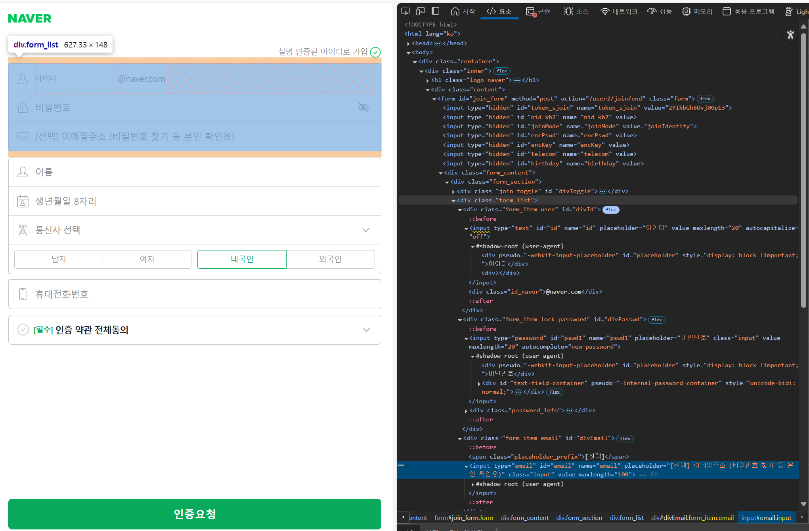
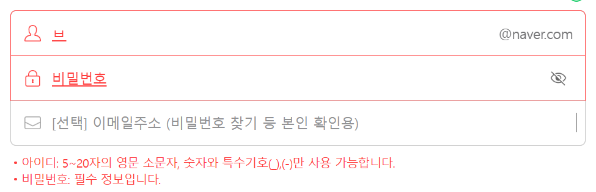
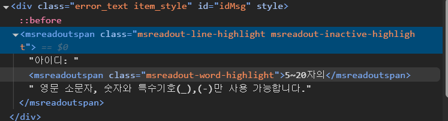
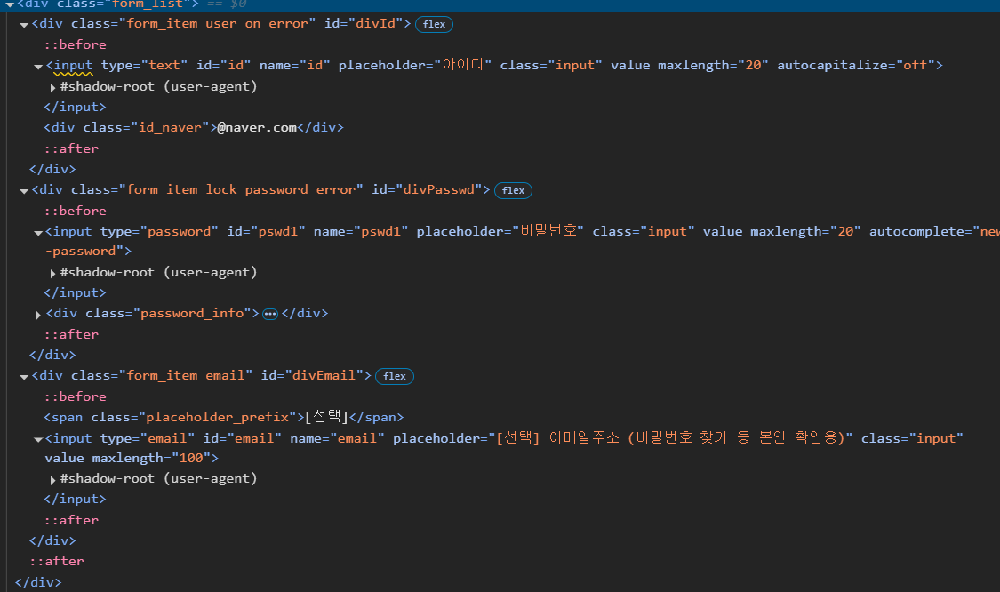
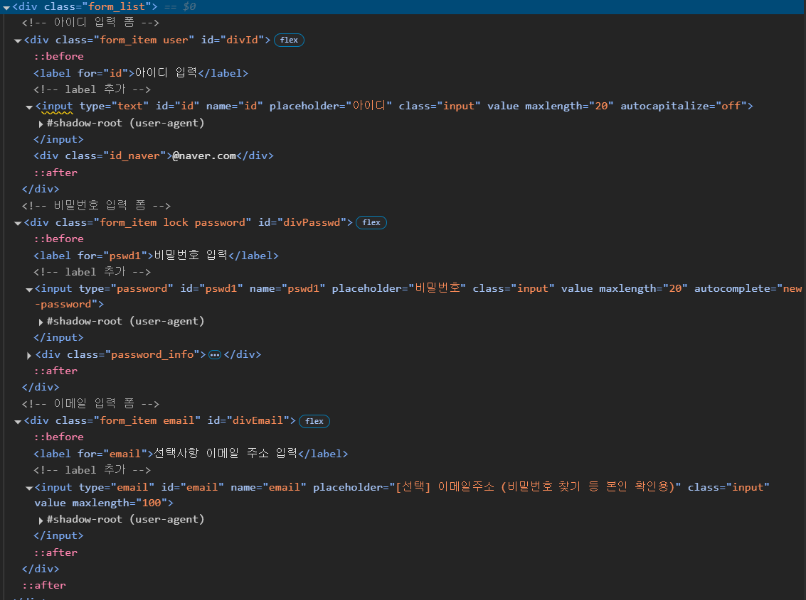

# [3차] 업무 요청서


# 네이버 회원가입 창의 스크린 리더 문제

## 현재 문제점 정리

- 스크린 리더가 **아이디, 비밀번호, 이메일 주소, 이름, 생년월일 입력 폼**을 읽어주지 못함
- 실명 인증된 아이디로 가입 -> @naver.com -> 통신사 선택 순으로 읽음
- 즉 사용자는 회원가입 창이라는 것을 유추해야 한다 (직관적이지 않음)



## 추가 이슈


입력 폼 오류 메시지는 시각적으로도 보이고, 음성으로도 확인이 가능하다. 오류 메시지는 어떻게 음성인식이 가능한걸까? 코드를 보니 `msreadoutspan`를 확인할 수 있다.




`msreadoutspan`은 **Microsoft**의 스크린 리더와 관련된 특수한 **HTML** 요소이다. 이 요소는 **Microsofrt Edge** 또는 **Windows** 내장 스크린 리더에서 사용되며,
자동적으로 업데이트되는 오류 메시지나 알림을 음성으로 읽어주는 역할을 한다.

`msreadoutspan` 은 개발자 도구에서 보이지 않거나, 페이지의 일반적인 DOM 트리에서 볼 수 없는 경우가 많다. 이는 이 태그가 스크린 리더에 의해만 동적으로 생성되고 사용되기 때문이다.

그래서 스크린 리더를 사용하고 에러 메시지를 읽어줄 땐 보이지만, 에러 메시지가 아닌 텍스트를 읽을 땐 사라진다.


# 스크린 리더가 입력폼을 왜 읽어주지 못할까??

## `label` 태그가 없는 경우
- 문제 : `label` 태그는 HTML 입력 필드에 대한 설명을 제공한다. 스크린 리더는 `label`을 읽고 사용자에게 입력 필드의 목적을 설명한다.
하지만, `label` 태그가 없으면, 스크린 리더가 필드의 목적을 알기 어려워 진다. 

- 해결 방안 : 각 입력 필드에 대해 `label` 태그를 추가하고, `for` 속성을 통해 입력 필드의 `id`와 연결한다

예시 코드

```html
<label for="id">아이디</label>
<input type="text" id="id" name="id" placeholder="아이디" />
```

## `placeholder`의 비효율성

- 문제 : `placeholder`는 입력 필드에 텍스트를 표시하지만, 사용자가 입력을 시작하면 사라진다. 스크린 리더는 이 텍스트를 제대로 읽지 못할 수 있다. 게다가
`placeholder`는 입력 필드의 목적을 명확하게 설명하지 못할 수 있다.

- 해결 : `label` 태그를 사용하여 각 입력 필드에 대한 설명을 제공하고, `placeholder`를 보조적으로 사용하는 방식으로 개선해야 한다.


## `Shadow DOM`과 오류 메시지 읽기

- 문제 : `Shadow DOM` 내에세 오류 메시지가 출력되면, 일반적인 `DOM` 접근 방식으로 오류 메시지를 읽을 수 없을 수 있다. 이는 스크린 리더가 `Shadow DOM` 내부의 내용을 제대로 처리하지 못하기 때문이다.

- 해결 : `Shadow DOM`을 사용하여 오류 메시지를 출력하는 경우, 스크린 리더가 해당 메시지를 인식할 수 있도록 `aria-live`와 같은 접근성 속성을 사용하는 것이 중요하다. `Shadow DOM` 내의 오류 메시지에도 `aria-live` 속성을 추가하여 메시지가 동적으로 갱신될 때 스크린 리더가 이를 읽을 수 있도록 해야 한다.


# 문제 

기존의 네이버 회원가입 페이지 코드 일부는 아래와 같다.




기존 코드의 문제점은 아래와 같다.
- 스크린 리더가 입력 필드의 목적을 정확히 이해하지 못하고 읽지 못함
- `placeholder` 텍스트는 입력을 시작하면 사라지기 때문에, 스크린 리더가 이를 읽지 못할 수 있다.
- 입력 필드가 어떤 설명과 연결되는지 스크린 리더가 인식하지 못한다.
- 명확한 텍스트 없이 `placeholder`만 사용하여 사용자가 정확하게 무엇을 입력해야 하는지 모름

# 문제 해결

- `label` 태그 추가하여 입력 필드와 그에 대한 설명을 명확하게 연결결
- `label` 태그가 `for` 속성을 사용하여 특정 입력 필드를 명확하게 지정



- `label` 태그를 추가하여 `for` 속성으로 `input` 필드와 연결된다. 
- `label for="id"`는 `id` 입력 필드를 설명하는 역할을 한다.
- 이로 인해 스크린 리더는 각 필드마다 **"아이디 입력"**, **비밀번호 입력**, **선택사항 이메일 주소 입력** 이라는 설명을 읽고, 해당 입력 필드의 목적을 명확하게 이해할 수 있다.


# 느낀점

네이버 회원가입 페이지 소스를 긁어와서 직접 수정해보면서 테스트를 진행했다. 네이버에서는 입력 폼이 시각장애인이 이용할 때 스크린 리더를 통해 이용한다면,

불편하다는걸 알고 있을텐데도 왜 기능이 이렇게 동작하는지 의문점이 들었다.

개인적인 추측으로는 

- 기존 시스템과의 호환성 문제거나 `Shadow DOM` 을 이용한 시각적인 UI를 고려해서 일 수 있다.


# 피드백


