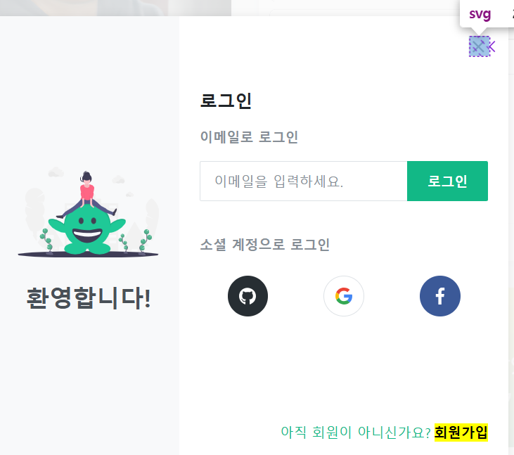
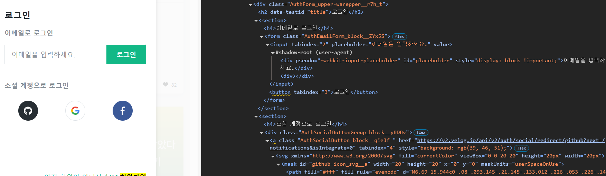
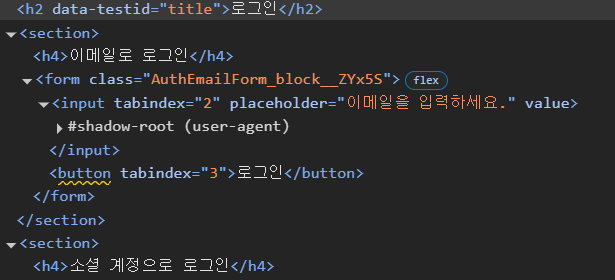

# [4차] 업무 요청서

[4차] 업무 요청서는 velog 메인 페이지를 분석하고 웹 접근성 문제점 개선하기이다.

아래는 `velog` 메인 홈페이지이다.


`라이트하우스`도구를 통한 웹 접근성 점수는 **91점**으로 표시되어 있다.


접근성 문제 항목을 보면, 링크에 인식 가능한 이름이 포함되어 있지 않다고 되어 있다.

이 말은 해당 링크에 대한 적절한 텍스트 설명이 없다는 걸 뜻한다. 해당 링크 태그들인 `velog`, `알림로고`, `돋보기`, 를 스크린 리더가 읽어주지 못하는 현상이 발생한다.


# 1. 알림 로고 코드 개선


처음에는 링크 내부에 텍스트 없이 `SVG`만 포함되어있어서 `aria-label`이나 `title`속성을 사용하여 스크린 리더에 읽힐 수 있도록 코드를 수정하였지만, 여전히 스크린 리더가 읽어주지 못하였다.

`CSS` 스타일을 보니까 `overflow: hidden`으로 되어있어서 스크린 리더가 읽어주지 못한걸 뒤늦게 알았다.

개발자 도구에서 `CSS` 수정은 불가능해서, `HTML`로 편집을 하였다.

```html
<div class="HeaderIcon_block__v1CF2" style="overflow: visible;"><svg xmlns="http://www.w3.org/2000/svg" viewBox="0 0 24 24"><path fill="currentColor" d="M4 19v-2h2v-7c0-1.383.417-2.612 1.25-3.688.833-1.075 1.917-1.779 3.25-2.112v-.7c0-.417.146-.77.438-1.063A1.447 1.447 0 0 1 12 2c.417 0 .77.146 1.063.438.291.291.437.645.437 1.062v.7c1.333.333 2.417 1.037 3.25 2.112C17.583 7.388 18 8.617 18 10v7h2v2H4Zm8 3c-.55 0-1.02-.196-1.412-.587A1.926 1.926 0 0 1 10 20h4c0 .55-.196 1.02-.588 1.413A1.926 1.926 0 0 1 12 22Zm-4-5h8v-7c0-1.1-.392-2.042-1.175-2.825C14.042 6.392 13.1 6 12 6s-2.042.392-2.825 1.175C8.392 7.958 8 8.9 8 10v7Z"></path></svg></div>
```

`HTML style` 속성을 직접 추가하고, `div`에 `style="overflow: visible;"`을 추가하고 테스트하였다.

그럼에도 스크린 리더가 읽어주지 못하였고,

`a`태그가 제대로 링크 역할을 인식하지 못하는 경우를 생각해, 명시적으로 `role="link"`를 추가했지만 결과는 똑같았다..

`aria-labelledby`를 활용한 `sr-only` 방식을 적용하는 방법도 있는 것 같지만 우선은 여기까지만 진행했다.


# 2. 팝업창 내에서의 개선 코드

**알림 로고 버튼**을 누르면 나타나는 로그인 팝업창이다.


<!--   svg 이미지 코드 --> 


우선 팝업창(모달)에서의 지켜야 하는 지침을 알아야 한다.

**1. 초점 관리(Focus Management)**
- 모달이 열리면 초점을 모달 내부의 첫 번째 초점 가능한 요소로 이동해야 한다.
- 모달이 닫히면 초점을 모달을 여는 버튼으로 돌려줘야 한다.
- `Tab`키를 눌렀을 때 초점이 모달 내부에서만 이동하도록 **포커스 트랩(focus trap)**을 적용해야 한다.

**2. 키보드 내비게이션 보장**
- `Esc`키를 누르면 모달이 닫히도록 구현해야 한다.
- `Enter` 또는 `Space` 키로 모달 내부의 버튼을 활성화 할 수 있어야 한다.
- `Tab` 키를 눌렀을 때 초점이 논리적으로 순환해야 하며, `Shift + Tab`을 누르면 역순으로 이동할 수 있어야 한다.

**3. ARIA 속성 활용**
- `role="dialog"` 또는 `role="alertdialog"`을 사용하여 모달임을 알려야 한다.
- `aria-labelledby`를 사용하여 모달 제목을 스크린 리더가 읽을 수 있도록 한다.
- `aria-describedby`를 사용하여 모달의 주요 설명을 제공해야 한다.

**4. 배경 요소 차단**
- 모달이 열려 있을 때 배경(백그라운드) 컨텐츠가 사용자의 키보드 탐색과 스크린 리더에서 접근되지 않도록 `inert` 속성을 적용하거나 `aria-hidden="true"`를 설정해야 한다.

**5. 색 대비 및 텍스트 가독성**
- 모달 내부의 텍스트와 배경 간 충분한 색 대비를 유지해야 한다.
- 버튼, 링크 등 인터랙티브 요소는 크기와 색상이 명확해야 한다.

**6. 모달 닫기 버튼 제공**
- 명확한 닫기 버튼을 제공하고, `aria-label="닫기"`같은 속성을 추가해 버튼의 기능을 알릴 수 있도록 해야 한다.


# 1. 팝업창 정보 문제점 및 해결 방안
- 팝업창이 열리고 스크린 리더를 실행하면, 모달창에 대한 정보를 읽어주지 못한다. 정확히는 모달창이라는 정보를 안알려주는 문제점을 발견했다.

- 일반인은 모달창을 열면 모달이 열린 것을 확인할 수 있지만, 시각장애인은 스크린 리더가 읽어주는 `HTML` 태그의 속성만으로 이를 구분해야 하기 때문에, 팝업창이 열렸는지 팝업창이 맞기는 한지 인식하기 어려울 가능성이 높다.

- 그래서 가장 기본적인 방법으로 스크린 리더가 UI의 힌트를 제공할 수 있도록 접근성 속성을 추가하는 것이다.

- 모달 컴포넌트에 `role="dialog"`, `aria-modal="true"` 속성을 부여해서 스크린 리더는 이것이 평범한 `div`나 `main`태그가 아닌 UI라는 힌트를 시각장애인에게 전달할 수 있게 된다.

**예시 코드**

```html
// 스크린 리더가 이 모달이 팝업 요소임을 알려줌
role="dialog" aria-modal="true"

// "로그인 팝업"
aria-labelledby="modal-header"

<Header id="modal-header">로그인</Header>
```

# 2. 초점 포커스 문제점 및 해결 방안 

- 모달창이 열렸을 때 포커싱이 팝업창으로 되어야 하지만, 포커싱이 안되는 문제점을 발견했다.

- 일반적으로 모달이 열리면 닫기 버튼(x)나 모달의 첫 번째 상호작용 가능한 요소인 이메일 입력란에 초점을 주면 사용자가 바로 입력할 수 있어서 UX 적으로 좋다.

- `useEffect`를 사용해서 모달이 열릴 때 이메일 입력란에 자동으로 포커스를 준다.

# 3. `Esc`키로 모달을 닫을 수 없는 문제점 및 해결 방안
- 모달창을 `Esc`키를 눌렀을 때 창이 닫혀야 하지만 닫히지 않는 문제점을 발견했다.

- `keydown` 이벤트에 간단한 핸들러를 추가함으로써 시각장애인이 컨텐츠를 읽다가 `Shift + Tab`을 수 차례 눌러 닫기 버튼을 다시 찾아야 하는 불편을 해소할 수 있다.

# 4. `Tab`키를 통한 키보드 조작 문제점 및 해결 방안
- `Tab`키를 눌렀을 때 탐색이 모달이 아니라 외부 요소인 백그라운드 컨텐츠에서 작동하는 문제점을 발견했다.

- `focus trap` 기법을 사용해서 모달이 열려 있는 동안에는 모달 내부의 요소들만 `Tab`을 통해 포커스가 가능하도록 해야 한다.


# 5. 닫기 버튼(X)의 문제점 및 해결 방안



- `닫기 버튼(X)`이 `button` 태그가 아니라 `SVG` 형식으로 되어있으며, 적절한 텍스트가 명시되어 있지 않고 스크린 리더가 읽어주지 못하는 문제점을 발견했다.
- `aria-label="닫기"` 속성을 추가해야 한다.

# 6. 로그인(팝업창) 스크린 리더 실행 문제점 및 해결 방안



- 스크린 리더를 실행했을때, 읽어주지 못하는 요소를 발견했다.
- 이메일 입력 필드에 대한 설명이 없다.
- 소셜 계정 로고 `깃허브`, `구글`, `페이스북` 로고들에 대한 적절한 대체 텍스트가 없다.
- 이메일 입력 필드에 `<label>,` `id`를 명확하게 연결해줘야 한다.

- `a`태그가 단순한 링크가 아니라 **로그인 버튼**이라는 걸 알 수 있도록 `role="button"`을 추가하고, `aria-label`을 이용해서 버튼의 의미를 명확하게 전달해야 한다.

# 7. 적절한 Heading 사용 문제점



웹 접근성에서의 `h1~h6` 태그 사용 지침은 아래와 같다.
- `h1`은 문서의 가장 중요한 제목이며 **페이지 전체의 주제를 나타내야 한다**
- h1은 **한 페이지에서 하나만 사용** (페이지의 대표 제목)
- 제목 태그는 **순차적으로** 사용 (h1 → h2 → h3 순서)
- 스타일링 목적으로 제목 태그를 사용하지 말 것 (CSS 활용)
- 제목 태그 안에는 **의미 있는 텍스트**가 있어야 함
- 버튼이나 일반 텍스트 강조에는 h 태그를 사용하지 말 것

코드에서의 문제점은 `h1`태그가 존재하지 않고
제목 태그가 논리적 순서 없이 중복 사용되고 있다.
또한 `h4`태그가 위치나 글씨 크기 조정용으로 사용되고 있다.


`h2` 로그인 태그를 `h1`태그로 변경하고,  `h4` 태그를 `h2`태그로 변경하는게 올바르다고 생각한다.


# 5주간의 웹 개발 인턴십을 마치며 : 웹 접근성 개선 경험

현직자와 함께하는 실시간 라이브 강의와 실제 웹 개발 업무 시나리오 요청서를 바탕으로, 웹 접근성을 깊이 있게 학습하고 개선하는 경험을 쌓았다.

**[1차] 업무 요청서** - 웹 표준의 이해, 올바른 `HTML` 구조와 시맨틱 마크업을 학습
  - 무의미한 `div` 남용 대신 의미 있는 태그로 문서 구조를 개선하고, 스크린 리더 사용자의 탐색 경험이 얼마나 개선되는지 직접 확인

**[2차] 업무 요청서** - 스크린 리더 사용법 분석 및 IR 기법 활용
  - 스크린 리더를 사용하여 시각장애인 사용자의 관점에서 웹을 경험하고 IR 기법을 적용해 시각적 요소가 보조기술에도 정확히 전달되도록 하는 방법을 익힘

**[3차] 업무 요청서** - 웹 접근성을 만족하는 UI 개선
  - `버튼`, `페이지 네비게이터`, `탭 UI`, `툴팁` 등 다양한 요소의 접근성을 검토하고 개선
  - `ARIA` 속성을 활용해 페이지 네비게이션 구현
  - 키보드 조작이 가능한 탭 인터페이스 구현현

**[4차] 업무 요청서** - 웹 접근성을 준수하는 페이지 구현 및 위배 사례 발굴 및 개선 코드 작성
  - `velog` 메인 페이지를 분석 및 접근성 위배 사례 개선 코드 작성


인턴십 이전까지 팀 프로젝트나 개발 과정에서 웹 접근성은 단순히 완료해야 할 **"체크리스트"**중 하나였다. 하지만 이번 경험을 통해 웹 접근성이 장애인만을 위한 특별한 배려가 아니라, 모바일 사용자, 느린 인터넷 환경의 사용자, 일시적 제약이 있는 사용자 등 **모든 사람을 위한 보편적 설계**라는 근본적인 가치를 깨닫게 되었다.

단순히 기능을 구현하는 것이 아니라, **다양한 환경과 조건에서도 모든 사용자가 동등하게 웹을 이용할 수 있도록 보장하는 것**이 프론트엔드 개발자의 핵심 역량임을 이번 인턴십을 통해 체감했다.

스크린 리더를 사용해보고, 키보드만으로 웹사이트를 탐색하는 과정에서 느꼈던 불편함은 내가 그동안 간과했던 사용자 경험의 중요한 측면이었다. 이러한 경험을 통해 웹 접근성에 대한 이해가 한층 깊어졌고, 이는 실무에서 반드시 적용해야 할 필수 역량임을 확신하게 되었다.

특히, 웹 접근성은 단순한 `"옵션"`이 아니라 **법적 기준을 충족하고, 더 많은 사용자를 포용하는 필수 요소**라는 점에서, 앞으로의 개발 과정에서도 최우선으로 고려하고 개선해 나갈 것이다.

인턴십에서 얻은 깨달음이 프론트엔드 개발자로서의 전문성과 경쟁력을 한층 강화해 주었고, 앞으로도 기술적 완성도와 함께 모든 사용자를 배려하는 접근성 높은 웹을 구현하는 개발자로 성장해 나가겠다!