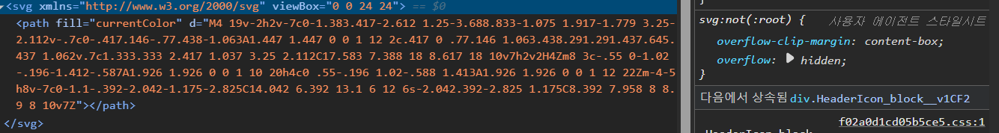

# [4차] 업무 요청서

velog 메인 페이지 웹 접근성 분석

메인 페이지


velog 메인 페이지는 위 사진과 같다.

라이트하우스 도구를 통해 웹 접근성 점수를 확인한 결과 


접근성 점수는 91점이다. 메인페이지에서 무엇이 문제였는지 항목을 확인해보면


링크에 인식 가능한 이름이 포함되어 있지 않다고 되어 있다.

메인페이지를 스크린 리더를 이용해 음성으로 들어보면 해당되는 `velog`,`알림로고`, `돋보기` 에 대한 음성지원이 안되는것을 확인했다.

`알림로고` 코드는 아래와 같다.




처음에는 링크 내부에 텍스트 없이 SVG만 포함되어있어서 `aria-label`이나 `title`속성을 사용하여 스크린 리더에 읽힐 수 있도록 코드를 수정하고 실행해봐도 읽히지 않고 해결하지 못하였지만,

`CSS` 스타일을 보니까 `overflow: hidden`으로 되어있어서 스크린 리더가 읽어주지 못한걸 뒤늦게 알았다.

개발자 도구에서 `CSS` 수정은 불가능해서, `HTML`로 편집을 하였다.

```html
<div class="HeaderIcon_block__v1CF2" style="overflow: visible;"><svg xmlns="http://www.w3.org/2000/svg" viewBox="0 0 24 24"><path fill="currentColor" d="M4 19v-2h2v-7c0-1.383.417-2.612 1.25-3.688.833-1.075 1.917-1.779 3.25-2.112v-.7c0-.417.146-.77.438-1.063A1.447 1.447 0 0 1 12 2c.417 0 .77.146 1.063.438.291.291.437.645.437 1.062v.7c1.333.333 2.417 1.037 3.25 2.112C17.583 7.388 18 8.617 18 10v7h2v2H4Zm8 3c-.55 0-1.02-.196-1.412-.587A1.926 1.926 0 0 1 10 20h4c0 .55-.196 1.02-.588 1.413A1.926 1.926 0 0 1 12 22Zm-4-5h8v-7c0-1.1-.392-2.042-1.175-2.825C14.042 6.392 13.1 6 12 6s-2.042.392-2.825 1.175C8.392 7.958 8 8.9 8 10v7Z"></path></svg></div>
```

`HTML` style 속성을 직접 추가하고, div에 `style="overflow: visible;"`을 추가하고 테스트하였다.

그럼에도 스크린 리더가 읽어주지 못하였고,

`a`태그가 제대로 링크 역할을 인식하지 못하는 경우 명시적으로 `role="link"`를 추가했지만 결과는 똑같았다..

`aria-labelledby`를 활용한 `sr-only` 방식을 적용하는 방법도 있는 것 같지만 우선은 여기까지만 진행했다.