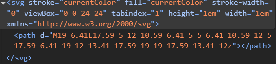

# [4차] 업무 요청서

[4차] 업무 요청서는 velog 메인 페이지를 분석하고 웹 접근성 문제점 개선하기이다.

아래는 `velog` 메인 홈페이지이다.


`라이트하우스`도구를 통한 웹 접근성 점수는 **91점**으로 표시되어 있다.


접근성 문제 항목을 보면, 링크에 인식 가능한 이름이 포함되어 있지 않다고 되어 있다.

이 말은 해당 링크에 대한 적절한 텍스트 설명이 없다는 걸 뜻한다. 해당 링크 태그들인 `velog`, `알림로고`, `돋보기`, 를 스크린 리더가 읽어주지 못하는 현상이 발생한다.


# 1. 알림 로고 코드 개선


처음에는 링크 내부에 텍스트 없이 `SVG`만 포함되어있어서 `aria-label`이나 `title`속성을 사용하여 스크린 리더에 읽힐 수 있도록 코드를 수정하였지만, 여전히 스크린 리더가 읽어주지 못하였다.

`CSS` 스타일을 보니까 `overflow: hidden`으로 되어있어서 스크린 리더가 읽어주지 못한걸 뒤늦게 알았다.

개발자 도구에서 `CSS` 수정은 불가능해서, `HTML`로 편집을 하였다.

```html
<div class="HeaderIcon_block__v1CF2" style="overflow: visible;"><svg xmlns="http://www.w3.org/2000/svg" viewBox="0 0 24 24"><path fill="currentColor" d="M4 19v-2h2v-7c0-1.383.417-2.612 1.25-3.688.833-1.075 1.917-1.779 3.25-2.112v-.7c0-.417.146-.77.438-1.063A1.447 1.447 0 0 1 12 2c.417 0 .77.146 1.063.438.291.291.437.645.437 1.062v.7c1.333.333 2.417 1.037 3.25 2.112C17.583 7.388 18 8.617 18 10v7h2v2H4Zm8 3c-.55 0-1.02-.196-1.412-.587A1.926 1.926 0 0 1 10 20h4c0 .55-.196 1.02-.588 1.413A1.926 1.926 0 0 1 12 22Zm-4-5h8v-7c0-1.1-.392-2.042-1.175-2.825C14.042 6.392 13.1 6 12 6s-2.042.392-2.825 1.175C8.392 7.958 8 8.9 8 10v7Z"></path></svg></div>
```

`HTML style` 속성을 직접 추가하고, `div`에 `style="overflow: visible;"`을 추가하고 테스트하였다.

그럼에도 스크린 리더가 읽어주지 못하였고,

`a`태그가 제대로 링크 역할을 인식하지 못하는 경우를 생각해, 명시적으로 `role="link"`를 추가했지만 결과는 똑같았다..

`aria-labelledby`를 활용한 `sr-only` 방식을 적용하는 방법도 있는 것 같지만 우선은 여기까지만 진행했다.


# 2. 팝업창 내에서의 개선 코드

**알림 로고 버튼**을 누르면 나타나는 로그인 팝업창이다.


<!--   svg 이미지 코드 --> 


우선 팝업창(모달)에서의 지켜야 하는 지침을 알아야 한다.

**1. 초점 관리(Focus Management)**
- 모달이 열리면 초점을 모달 내부의 첫 번째 초점 가능한 요소로 이동해야 한다.
- 모달이 닫히면 초점을 모달을 여는 버튼으로 돌려줘야 한다.
- `Tab`키를 눌렀을 때 초점이 모달 내부에서만 이동하도록 **포커스 트랩(focus trap)**을 적용해야 한다.

**2. 키보드 내비게이션 보장**
- `Esc`키를 누르면 모달이 닫히도록 구현해야 한다.
- `Enter` 또는 `Space` 키로 모달 내부의 버튼을 활성화 할 수 있어야 한다.
- `Tab` 키를 눌렀을 때 초점이 논리적으로 순환해야 하며, `Shift + Tab`을 누르면 역순으로 이동할 수 있어야 한다.

**3. ARIA 속성 활용**
- `role="dialog"` 또는 `role="alertdialog"`을 사용하여 모달임을 알려야 한다.
- `aria-labelledby`를 사용하여 모달 제목을 스크린 리더가 읽을 수 있도록 한다.
- `aria-describedby`를 사용하여 모달의 주요 설명을 제공해야 한다.

**4. 배경 요소 차단**
- 모달이 열려 있을 때 배경(백그라운드) 컨텐츠가 사용자의 키보드 탐색과 스크린 리더에서 접근되지 않도록 `inert` 속성을 적용하거나 `aria-hidden="true"`를 설정해야 한다.

**5. 색 대비 및 텍스트 가독성**
- 모달 내부의 텍스트와 배경 간 충분한 색 대비를 유지해야 한다.
- 버튼, 링크 등 인터랙티브 요소는 크기와 색상이 명확해야 한다.

**6. 모달 닫기 버튼 제공**
- 명확한 닫기 버튼을 제공하고, `aria-label="닫기"`같은 속성을 추가해 버튼의 기능을 알릴 수 있도록 해야 한다.


# 1. 팝업창에 대한 정보 문제점
- 팝업창이 열리고 스크린 리더를 실행하면, 모달창에 대한 정보를 읽어주지 못한다. 정확히는 모달창이라는 정보를 안알려주는 문제점을 발견했다.

- 일반인은 모달창을 열면 모달이 열린 것을 확인할 수 있지만, 시각장애인은 스크린 리더가 읽어주는 `HTML` 태그의 속성만으로 이를 구분해야 하기 때문에, 팝업창이 열렸는지 팝업창이 맞기는 한지 인식하기 어려울 가능성이 높다.

- 그래서 가장 기본적인 방법으로 스크린 리더가 UI의 힌트를 제공할 수 있도록 접근성 속성을 추가하는 것이다.

- 모달 컴포넌트에 `role="dialog"`, `aria-modal="true"` 속성을 부여해서 스크린 리더는 이것이 평범한 `div`나 `main`태그가 아닌 UI라는 힌트를 시각장애인에게 전달할 수 있게 된다.

**예시 코드**
