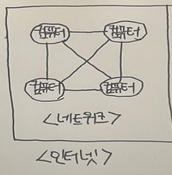
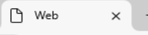

**웹**을 알려면 먼저 네트워크와 인터넷을 알아야 한다. **네트워크**는 **컴퓨터**와 **컴퓨터**를 연결해주는 망이다.



이런 망들이 모여서 더 큰 네트워크인 **인터넷**이 되는 것이다!!

**인터넷 >> 네트워크 >> 컴퓨터**

그렇다면 **웹**은 뭘까? **World Wide Web**의 줄임말로, 인터넷에 연결된 사용자들이 서로 정보를 공유할 수 있는 서비스이다. **WWW** 혹은 **W3** 이라 부르는데, 보통은 **'웹'**이라고 부른다. 여기서 말하는 서비스는 텍스트, 그림, 소리, 영상 등의 정보를 제공해주는 것을 말한다.

## 웹 페이지란

**웹 페이지**는 정보를 **하이퍼텍스트**라는 특별한 양식으로 제공하는 **웹 문서**이다. 브라우저에서 [www.naver.com](http://www.naver.com) 에 접속하면 네이버에서 제공하는 기본 화면을 가져온다. 이때 보여준 기본 화면이 네이버 기본 웹 페이지이다.

## 웹은 어떻게 동작하지?

`F12` **개발자 도구**를 눌러보면 빽뺵하게 적힌 영문이 있다 이건 바로 우리에게 **글과 그림** 등을 보여주는 **HTML 코드**이다.

**인터넷**은 `클라이언트(client)`와 `서버(server)` 사이를 오가며 동작한다. **클라이언트**가 **서버**에게 요청하고 **서버**는 **클라이언트**에게 응답한다.

**요청**과 **응답**이 일어날 때 **웹 페이지 코드**가 **서버**에서 **클라이언트**로 전달되는데, 이때 **HTTP 통신 규약**을 이용한다. **HTTP 통신 규약**으로 실어 나르는 대상인 문서는 **하이퍼텍스트** 양식으로 되어 있고, **하이퍼텍스트**는 **HTML** 이라는 **마크업 언어**를 사용해 작성한다.

## 쉽게 설명하면?

`F12`키 **개발자 도구**를 누르면 나오는 복잡한 영문들, 사실 그게 우리가 보는 **웹 페이지**의 '**설계도**'이다. **설계도**를 작성하는게 바로 `HTML`이라는 **마크업 언어**이다. **HTML**은 **웹 페이지**의 구조를 만드는 **건축가** 같은 거지.

**웹**의 동작 방식은 **레스토랑**에서 **주문**을 주고받는 것과 비슷하다. 내가 손님(클라이언트)이고, **서버**는 음식(웹 페이지)을 서빙하는 **웨이터**라고 상상해보자. **서버**가 **주방**에서 **음식**을 만들어 나에게 가져다 준다(**응답**), 이 때 **메뉴판**에 뭐가 적혀있나면, **HTML**로 작성된 **웹 페이지**의 **설계도**가 담겨 있는 것이다.

그리고 그 **음식**이 오는 길, 그게 바로 **HTTP** 라는 **규칙**을 따라서 움직인다. **HTTP**는 **서버**와 **클라이언트**가 서로 이해할 수 있는 '**공용어**' 같은 거다. 덕분에 **서버**는 내가 원하는 **웹 페이지**를 정확히 전달할 수 있는 것이다.

## HTML 이란

`HTML`은 **HyperText Markup Language**의 약자이다.  
'하이퍼텍스트를 마크업하는 언어'이다. **하이퍼텍스트**란 **정해진 순서 없이**, **참조**를 통해 **한 문서에서 다른 문서로 접근할 수 있는 텍스트**를 말한다.

예를 들어 **웹 페이지**에서 **링크**를 누르면 **다른 페이지로 이동**되는게 바로 **하이퍼텍스트**에서 제공하는 **하이퍼링크 기능** 덕분에 가능한것이다.

그렇다면 **마크업하는 언어**는 무엇일까?? **마크**는 '**표시**'로 해석할 수 있으니 '**표시하는 언어**'로 이해하면 된다.

HTML은 프로그래밍 언어가 아니다. 마크업, 즉 표시하는 언어이다. **웹 페이지**의 **구조를 지정**하는 아이일 뿐 **프로그램 자체를 만들지는 못한다.**

결론적으로 **HTML**은 '**웹 페이지의 구조를 나타내는 마크업 언어**' 라고 생각하면 된다.

## HTML 기본 구조

아래 코드는 HTML 기본 구조이다.

```html
<!DOCTYPE html> <!-- 1 -->
<html lang="ko">
<head>   <!-- 2 -->
  <meta charset="UTF-8" />   <!-- 4 -->
  <meta http-equiv="X-UA-Compatible" content="IE=edge">  <!-- 4 -->
  <meta name="description" content="">
  <meta name="viewport" content="width=device-width, initial-scale=1.0" />
  <title>Web</title> <!-- 3 -->
</head>
<body>
   <p>Hello World</p>
</body>
</html>
```

위 코드에 번호를 매긴 것은 **주석**이다 그 외의 모든 내용은 **컴퓨터가 해석하는 코드**이고,

**주석**은 **프로그램 동작에 아무런 영향**을 미치지 않는다.

## 1\. !DOCTYPE html

모든 HTML 문서는 <!DOCTYPE> 선언으로 시작한다. HTML 태그가 아니라 **문서 유형에 대한 브라우저의 정보**이다.

## 2\. head 태그

페이지를 열 때 브라우저에 요소가 표시되는 body 태그와 다르게, head 태그는 페이지에 표시되지 않는다. 대신에 **페이지 정보(메타 데이터)를 제공한다.**

## 3\. title 태그

HTML 문서 제목을 표현한다. 현재 title은 위 코드에서 확인하다시피 Web 으로 되어 있다. 웹 페이지 상단에 타이틀로 확인이 가능하다.



## 4\. meta 태그

**메타 데이터**를 알려주는 태그이다. 메타 데이터는 **데이터를 설명하는 데이터**이다. 예를 들어 글을 썼다고 가정하자.

해당 글을 나중에 검색할 때 **작성자 이름**으로 검색할 수도 있고, **날짜**로 **검색**할 수도 있다. 이때 **작성자**. **날짜**가 **메타 데이터이다**. 메타 데이터를 활용하면 특정 데이터를 쉽게 찾을 수 있다!!

head 태그 안에 다양한 meta 태그가 있는데,

-   meta charset="utf-8" 이 요소는 문서에서 허용되는 문자를 표시한다. utf-8은 전 세계적인 문자 집합으로 많은 언어를 포함한다. 그래서 우리가 어떤 언어를 사용해도 웹 페이지는!! 읽을 수 있는 것이다.
-   meta name ="description" content="" name은 메타 요소가 어떤 형태의 정보를 갖고 있는지 나타낸다. content는 실제 메타 데이터의 요소이다. name이 "description"일 때 content에는 해당 사이트의 소개 문구를 적게 된다. 검색 엔진에서 검색된 사이트명 바로 밑에 있는 설명 글이라고 생각하면 된다.

아래 사진은 나의 블로그에 적은 글이다.


1회사 스프린트 회고 밑에 약 5개월 동안 적힌 내용이 이제 name이 "description" 일 때 content 내용이라고 생각하면 된다.

-   meta name="viewport" contetn="width=device-width, initial-scale=1" 뷰포트는 요소를 볼 수 있는 화면이다. 일반적으로 웹 페이지는 한 화면보다 크거나 길다. 화면 스크롤을 내려보면 브라우저가 사용자에게 스크롤 기능을 제공해 가능한 기능인데, 이때 device-width와 inital-scale-1은 개인마다 갖고 있는 기기 화면에 맞춘다는 뜻이다.

## 태그

**태그(Tag)**는 **꼬리표**라는 뜻으로 **HTML**에서는 웹 문서에 **정보를 정의**해주는 형식이다. 태그로 데이터를 감싸서 데이터 형식과 의미를 브라우저에게 알려준다. 태그는 **<>** 로 감싸 표현하고. 그 안에 원하는 형식을 지정하는 스타일이다.

**<>**는 **시작**을, **</>**는 **끝**을 의미한다.

```
<html> 코드 시작

</html> 코드 끝
```

## 웹 페이지 vs 웹 사이트

웹 페이지는 하이퍼텍스트로 작성된 문서이다. 대표적인 하이퍼텍스트는 내가 위에서 언급한 HTML이 있다.  
대부분의 웹 페이지 구조는 HTML로 작성한다고 보면 된다. 웹 사이트는 URL 기반으로 인터넷에서 서비스되는 웹 페이지의 집합이다.

-   **웹 페이지** = 하이퍼텍스트로 작성한 문서
-   **웹 사이트** = 인터넷에서 URL로 제공되는 웹 페이지의 묶음!

쉽게 설명하면 재가 좋아하는 책 한권이 있다.

**웹 페이지**는 = **책 페이지**, **웹 사이트**는 = **책** 이라고 생각하면 편하다.

## URL과 www

URL은 **uniform resource locator** 의 약자로 네트워크에서 자원의 위치를 알려주는 규약이다. "**웹 페이지의 주소**" 라고 흔히 말한다. URL을 실제로 웹 주소(web address)라고도 부른다.

URL은 **www**로 시작한다. **www**? 위에서 내가 말한 **World Wide Web** 의 약자이다. 웹으로 알려진 **World Wide Web**은 인터넷에서 하이퍼텍스트 문서를 제공하는 시스템이다. 하이퍼텍스트 문서는 HTML로 쓰여 있고, 통상 웹 브라우저로 읽는다.

웹 페이지를 분석해 텍스트, 이미지, 비디오 또는 음악 같은 요소를 보여주는 프로그램이 브라우저의 역할이다!!.

## HTML과 CSS는 프로그래밍 언어가 아니다.

HTML은 단독으로 프로그램을 만들 수 없다. 왜?? HTML은 **하이퍼텍스트 문서를 코딩하는 언어**이지. 하이퍼텍스트 문서 자체가 프로그램은 아니기 때문

HTML은 하이퍼텍스트를 표시하는 언어, 즉 **마크업(Markup) 언어**이다. HTML을 보기 좋게 꾸며주는 **CSS** 또한 마찬가지이다.