<h1>HTML 태그</h1> 

`태그`를 표시하는 방법은 총 두 가지이다.

첫 번째는 **시작 태그**와 **종료 태그**가 모두 있는 형태이다. 태그와 태그 사이에 **요소**가 놓이게 된다.

```html
<태그명> 요소 <태그명>
```

두 번째는 닫는 태그가 없는 형태이다. 이를 자체 **닫기 태그**(self closing tag)라고 부른다. `img`, `input`, `link` 등이 있다.

```html
<태그명  요소 > 
```

## 대표적인 태그
- `h` : 제목 태그
- `br`, `p`, `div`, `span` : 순서대로 줄바꿈(br), 문단 지정(p), 영역 지정(div), 범위 지정(span)
- `link` : 현재 문서와 외부 소스를 연결해주는 태그
- `img` : 이미지를 나타내는 태그
- `form` : 폼(입력 양식)을 만드는 태그
- `button` : 버튼을 만드는 태그
- `ol`, `ul`, `li` : 리스트를 만드는 태그

## h 태그
h 태그는 heading의 첫 자를 따서 만들었다. 'heading'은 `제목`을 의미한다. 따라서 h 태그는 HTML의 제목을 나타낸다. h 태그가 중요한 이유는 `검색 엔진`이 h 태그에 기반하여 결과물을 보여주기 때문이다. 따라서 검색되고 싶은 키워드가 있다면 h 태그에 넣으면 좋다.

```html
<h1>heading 1</h1>
<h2>heading 2</h2>
<h3>heading 3</h3>
<h4>heading 4</h4>
<h5>heading 5</h5>
<h6>heading 6</h6>
```
결과는 사진과 같다.


h 태그는 `h1 ~ h6` 까지 있는데, 특징은 다음과 같다.
- 별도의 줄바꿈 없이 자동으로 줄이 바뀐다.
숫자가 커질수록 글자 크기자 작아짐 (반비례)

**주의할 점**
- HTML 한 페이지에서 h1 태그는 한 번만 사용하기
- h 태그는 제목을 나타태는 코드이므로 문단 처음에 배치하기
- 검색 엔진에 사용되는 태그이므로 검색어를 고려하기
- h1~h6 순서대로 사용하기(권장 사항)

## br, p 태그

```html
<P>
  Hi My Name is JungHo<br />
  front end developer<br />
  26 years old<br />
  ESFJ<br />
</P>
<p>
  Hi My Name is JungHo2<br />
  front end developer2<br />
  26 years old2<br />
  ESFJ2
</p>
```


실행 결과 `p 태그`를 기준으로 문단이 나뉘었다 마치 `enter`를 두 번 친 것(br 태그를 두 번 사용) 한 것과 같은 결과를 보여준다.

## div, span 태그

```html
text1<div>text2</div>text3
```


```html
text1<span>text2</span>text3
```


`div`와 `span` 태그는 앞서 본 `br`, `p` 태그와 별 차이가 없어 보이지만 그렇지 않다. `div`태그는 줄을 바꾼다. `span` 태그는 줄바꿈이 없다. 주로 `p`태그는 문단 형태를 쓸 때 사용하고 `span` 태그는 단어 등 문장의 형태로 보기 어려운 텍스트에 사용한다.

 이 태그의 줄바꿈 요소 등은 스타일링을 도와주는 CSS를 사용해 바꿀 수 있다. 하지만 각 태그마다 가지고 있는 속성을 올바르게 사용하면 내 코드가 제목인지, 단어인지, 문장인지 등을 분명하게 표현할 수 있다.

 ## link 태그

`link` 태그는 현재 파일이 다른 파일과 연결되어 있는 관계 정보를 표현하는데 사용한다. 예를 들어 HTML 구조를 만들고 그 구조를 시각적으로 보기 좋게 디자인할 때 CSS 라는 언어를 사용하는데 CSS는 외부 파일로 만들어 HTML에 연결해줄 수 있다. 이때 `link` 태그를 사용한다. 즉 `link` 태그는 CSS나 PNG 파일 등과 현재 HTML 문서와의 관계를 정의하는 데 사용한다.

`link` 태그의 기본 구조이다.

```html
<link rel = "속성" href ="파일 경로">
```

- link : <link 태그를 시작
- rel : relations를 나타낸다. 대상 파일의 속성을 알려준다.
- href : hyper-references를 나타낸다. 연결 시 참조할 파일 위치를 알려준다.

예를 들어 CSS 파일을 연결하는 코드는 아래와 같다.

```html
<link rel = "stylesheet" href="style.css">
```

rel="stylesheet" 는 stylesheet, 즉 CSS 속성을 가진 파일과 연결(관계) 한다는 의미이다. href="style.css"는 stlye.css 파일을 링크한다. 현재 파일에서 외부에 있는 자원인 style.css 파일을 스타일시트 관계로 연결시켜 사용한다는 뜻이다.

## a 태그

비슷한 태그로 a 태그가 있다. a 태그는 href 속성을 사용해 링크로 이동할 수 있다.

```html
<a href ="https://www.naver.com/">NAVER</a>
```


## img 태그
img는 image의 약자로 HTML 문서에 이미지를 삽입하는 태그이다. 주요 속성으로 src, alt, width, height를 제공한다. 기본 형식은 아래와 같다.

```html

```
- src : 이미지 경로
- alt : alternative(대체하다)의 약자로, 이미지를 설명하는 문구
- width : 이미지 가로 크기
- height : 이미지 세로 크기


**alt 속성은 적지 않아도 실행은 되지만 적어주는 게 좋다. src에 지정한 이미지를 제대로 읽어오지 못할 때 alt 속성에 적은 문구가 보이게 된다.**

`alt`는 시각장애인을 위한 스크린리더를 지원한다. 스크린리더란 화면을 읽어주는 프로그램으로 스크린리더가 화면의 글을 읽을 때 `alt`값을 참조한다. 따라서 `img`태그뿐만 아니라 다른 태그에서도 `alt` 속성이 있다면 써주는 것이 좋다.

멋쟁이사자처럼 프론트엔드 교육을 배웠을 때, **웹 접근성**의 중요성에 대해서 배운 적이 있는데, 문득 생각이 난다!!

## form 태그
`form` 태그는 사용자 입력 양식을 만들 때 사용한다. 많은 요소가 있지만 많이 쓰이는 `input`, `label`을 보자

form 태그 기본 형식은 아래와 같다.
```html
<form>form 요소 태그</form>
```

```html
<form action="myform.html">   <!--1-->
  <label for="fname">first name:</label> <!--2-->
  <input type="text" id="fname"> <!--3-->
  <label for="lname">last name:</label> <!--4-->
  <input type="text" id="lname"> <!--5-->
  <input type="submit"> <!--6-->
</form>
```


`3`, `5` input 태그는 사용자 입력을 받는 폼이다. 사진에 보면 흰색 칸이 해당된다.
`2` first name과 `4` last name은 레이블(라벨)을 붙인다 상품에 스티커 라벨을 붙이듯 폼에 이름을 붙여준다. `6` input 태그에 type 속성을 `submit`으로 주어 실행 버튼 제출을 만들었다.

`1` form 태그의 역할은 제출 버튼을 눌렀을 때 입력값을 처리할 대상을 지정해준다. 코드에서 form 태그의 action 속성을 이용해 myform.html로 이동하라고 지정했다. 

## input 태그
`input` 태그는 사용자가 데이터를 입력하는 영역을 결정한다. `input` 태그의 대표 속성은 아래와 같다.

- `type` : input 태그의 속성을 결정한다. 값으로는 `text`(텍스트 입력), `checkbox`(체크박스), `password`(패스워드), `data`(날짜) 등이 있다.
- `id` : input의 이름을 지정해주는 역할을 한다.

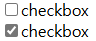


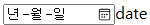


## label 태그

라벨지라는 말이라고 생각하면 편하다. `input` 태그에 라벨지를 붙여준다고 생각하면 된다. `label`을 사용하면 시각장애인이 폼을 음성으로 들을 수 있다.

- for : label이 설명하는 input 등의 id를 지정한다.

## button 태그

`button` 태그는 클릭할 버튼을 만들 때 사용한다. button 태그 안에는 텍스트나 이미지 같은 요소를 삽입할 수 있다. 기본형태는 아래와 같다

```html
<button type ="속성값">설명</button>
```
- type : 버튼 종류를 지정한다. `button`, `submit`, `reset` 을 지정할 수 있다.
- 설명 : 버튼에 노출되는 문구

`type`으로 올 수 있는 3가지 속성값은 다음과 같다. 생김새는 같지만 다른 성격을 가지고 있다.
- button : 누를 수 있는 버튼
- submit : form을 제출하는 버튼
- reset : form의 입력값을 초기화하는 버튼

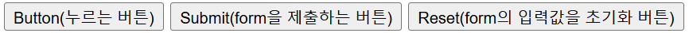

## 리스트 태그 : ol, ul

목록을 표시하는 리스트 태그에는 `ol`, `ul` 태그가 있다. `ol` 태그는 ordered list의 약자로 순서가 있는 리스트를 뜻한다. `ul` 태그는 unoredered list의 약자로, 순서가 없는 리스트를 뜻한다.

`li`는 list item의 약자로, 목록을 구성하는 개별 항목(아이템)을 뜻한다.

기본 형식은 아래와 같다.

```html
<ol>
  <li>아이템 1</li>
  <li>아이템 2</li>
  <li>아이템 3</li>
</ol>
```

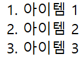

순서가 없는 `ul` 태그 리스트의 기본 형식은 아래와 같다.

```html
<ul>
  <li>아이템 1</li>
  <li>아이템 2</li>
  <li>아이템 3</li>
</ul>
```

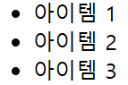

---


만약 `ol` 태그 안에 또 `ol` 태그를 넣으면 어떻게 될까??

그러면 먼저 `HTML` 태그의 부모 자식 관계를 알아야 한다.

## 태그의 부모 자식 관계

`HTML` 에서 관계를 표현하는 방식으로 '부모'와 '자식' 이라는 단어를 사용한다.
컴퓨터가 웹 페이지에 보여주는 구성은 생각보다 단순하지 않다. 우리가 보는 웹 페이지는 `트리 구조`로 구성되어 보인다. **트리 구조**란, 나뭇가지처럼 각 요소가 하나 이상의 요소에 연결되는 데이터 구조 유형이다

아래 그림처럼 말이다.

위에 작성한 코드에서 `ol` 태그는 **부모**이고, `li` 태그는 **자식**을 나타낸다. 이 구조를 알아야 하는 이유가 부모가 자식에게 영향을 주기 때문이다. 유전자 같은 느낌으로 컴퓨터에서도 부모가 자식에게 주는 영향이 있다.

아래 코드에서 `1등`을 지우면 어떻게 될까???

```html
<ol>
  <li>1등</li>
  <li>2등</li>
  <li>3등</li>
</ol>
```
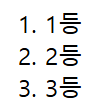 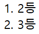

- 결과는 위 사진 처럼 `2등`이 `1번쨰` 자리로 간 걸 확인할 수 있다.


이 코드의 과정이 어떤 영향을 끼칠까?? 만약 이 태그가 1,000개로 이루어진 학생들이 1000명이 있다고 가정하고, 항목을 지우고, 모든 항목에서 순번 숫자를 일일이 바꿔야 한다면?? 완전 노가다일 것이다.

하지만 `ol` 태그는 자동으로 자식 태그에 순서대로 번호를 붙여주니 수고를 덜 할 수 있다. 이게 부모 태그의 영향력이며 부모, 자식 관계로 연결되어 있기 때문에 가능한 일이다.


`HTML` 에서 `ol` 태그는 중첩될 수 있지만, 각 `ol` 태그는 반드시 그 자식 요소로 `li` 태그를 가져야 한다.


---
```html
<ol>  <!--최상위 부모 ol태그  -->
    <li>최상위 부모 ol 태그 안의 첫째 li 태그</li> <!--최상위 부모 ol 태그의 첫 자식 li 태그  -->
    <ol> <!-- 최상위 부모의 두 번째 부모 ol 태그 -->
      <li>첫째 li 태그 밑에 부모 ol 태그의 자식 li태그 </li> <!--두 번째 부모 ol 태그의 자식 li 태그 -->
    </ol> <!-- 두 번째 부모 태그 종료  -->
  </ol> <!-- 최상위 부모 태그 종료  -->
```

## HTML과 검색되는 텍스트

페이지를 읽을 때 **마우스 커서**가 **글을 인식**할 때 바뀌는 모양이랑 **이미지를 인식**할 때 바뀌는 모양이 서로 다른데 why?

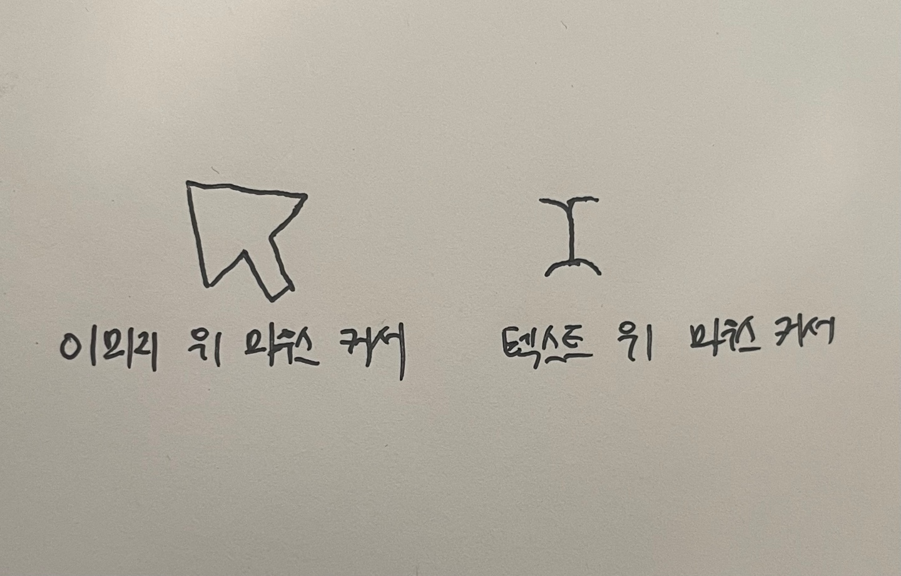


어떤 상세페이지는 제품 설명 글을 몽땅 이미지에 넣어버린다. 깔끔하게 보일 순 있지만, 이렇게 하면 이미지에 넣은 글씨가 검색되지 않는다.

예를 들어 핸드폰 케이스를 구매하고 싶어서 '핸드폰 케이스'라고 검색했을 때, 모든 제품 정보가 이미지로 되어 있다면??? 

검색 엔진은 해당 제품을 검색하지 못한다.


```html
<h2>case</h2>
<strong><span style="font-size: 23px;">case</span></strong>
```
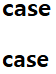

위 두 글씨는 보기에는 똑같아 보이지만 코드는 다를 수 있다.

첫 `case`는 제목(h2) 태그를 이용하여 case를 제목으로 지정했다. 반면, 두 번째 줄 case는 크기와 굵기만 지정한 제목이 아닌 글자이다.

겉모습은 차이가 없지만 검색 엔진에는 의미가 다르다. 검색 엔진이 노출 시켜주는 것은 제목 태그(h2)를 사용한 첫 번째 코드가 들어간 case 페이지 인거다.

**검색되지 않는 웹 페이지는 존재하지 않는 것과 마찬가지이다** 페이지가 잘 검색되도록 신경을 기울어야 한다. 따라서 검색을 고려해 HTML 코드를 작성해야 하는데, 이를 위해선 검색 엔진과 검색 엔진 최적화를 알아야 한다.


## 검색 엔진

검색 엔진(search engine)이란 여러 웹 사이트나 웹 페이지 등을 검색해주는 시스템이나 프로그램을 통칭한다. 검색 엔진은 웹에서 원하는 정보를 찾는 데 걸리는 시간을 최소화해준다.

## 검색 엔진 동작 원리

사용자가 검색을 했을 때 원하는 결과를 빠르게 보여주려고 수많은 정보를 미리 정리해놓는다. 이 과정을 자동으로 데이터베이스화시키는 프로그램을 봇(bot) 또는 크롤러(crawler)라고 부른다.

 검색 엔진은 봇이 주기적으로 웹 사이트들을 방문하여 쌓은 정보를 정리한 후, 데이터베이스에 저장한다. 이 정보는 이후 사용자가 검색할 때 결과를 빠르고 정확하게 보여주는 데 사용된다.

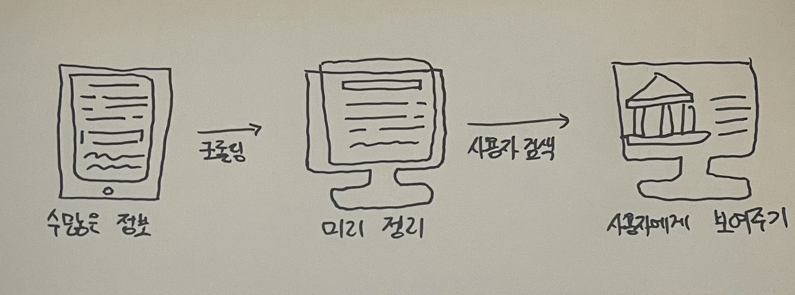


## 검색 엔진 최적화

검색 엔진 최적화란 Search Engine Optimization의 약자로 SEO라고도 부른다. SEO는 검색이 잘 되도록 설계하는 일을 말한다. HTML로 웹 페이지를 만들면서 검색 엔진 최적화를 하는 두 가지 방법이 있다. 메타 태그와 시맨틱 태그를 사용하는 방법이다.

메타 태그와 시맨틱 태그는 웹 페이지 정보를 검색 엔진에 제공하는 태그이다. 메타 태그와 시맨틱 태그를 제대로 작성해주지 않으면 페이지가 제대로 검색되지 않는다.

- 메타 태그 : 검색 엔진에 정보를 제공할 목적의 태그
- 시맨틱 태그 : 웹 페이지 구조를 구성하는 태그

## 메타 태그

```html
<!DOCTYPE html>
<html lang="ko">
<head>
  <meta charset="UTF-8" />   <!-- 1 -->
  <meta name="Description" content="Author: 오정호, Category: 리드미" /> <!-- 2 -->
  <title>HTML 리드미</title> <!-- 3 -->
</head>
<body>
  
</body>
</html>
```

`1` charset을 utf-8로 설정함으로써 모든 언어를 지원한다. `2` meta 태그에 이름과 요소를 작성해 웹 페이지를 설명한다. `3` title 태그로 웹 페이지의 제목을 알려준다.

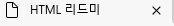

## 시맨틱 태그

시맨틱 태그에서 Semantic에는 '의미론적인' 이란 뜻이 있다. 시맨틱 태그는 의미 있는 태그라고 해석하면 된다. 검색 엔진은 HTML 코드만으로 의미를 인식해야 한다. 이때 시맨틱 태그 안의 요소를 해석하게 된다. 시맨틱 요소로 구성된 웹 페이지는 검색 엔진에 문서 정보를 더 의미 있게 전달할 수 있고 검색 엔진 또한 시맨틱 요소를 이용하여 정보를 더 효과적으로 불러오고 읽을 수 있다.


## 상황을 예시로 설명

시맨틱 태그를 쉽게 설명하자면, 웹 페이지가 "소개팅을 가서 자기소개를 하는 장면"을 떠올리면 좋다. 시맨틱 태그는 웹 페이지의 "소개팅 자기소개" 같은 거다!

예를 들어, `<Header>`는 마치 "안녕하세요 저는 오정호입니다!" 하고 첫인사를 하는 역할을 한다. `<section>`은 "제가 하고 싶은 얘기는 이런 것들이에요" 하고 주제에 대해 말하는 부분이고 `<footer>` 는 "오늘 소개팅 어땠는지!!" 하고 마무리 인사를 하는 곳이라 생각하면 된다.

---
즉, 시맨틱 태그는 브라우저, 검색 엔진, 개발자 모두에게 요소 의미를 명확히 설명하는 역할을 한다. 

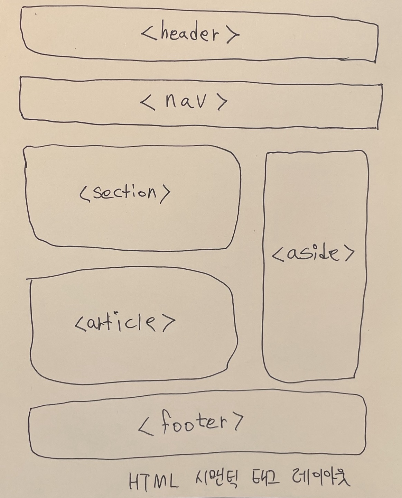

HTML 태그는 **시맨틱**과 **비시맨틱** 태그로 구분할 수 있다.

- **시맨틱 태그** : 검색 엔진 봇이 읽을 수 있는 문서 구조를 작성하는 데 사용한다. `h1`, `p`, `form`, `label` 등 지금까지 배운 대부분 태그가 여기 해당한다. HTML5에서는 `header`, `nav`, `aside`, `section`, `article`, `footer` 등 레이아웃과 관련한 태그들이 새로 추가되었다.
- **비시맨틱 태그** : 요소에 대하여 어떤 설명도 하지 않는 태그이다. `div`, `span` 등이 있다.

- `<header>` : 소개 요소 또는 탐색 링크를 나타냄
- `<nav>` : 탐색 링크를 정의한다. 주로 메뉴를 구현
- `<section>` : 본문 내용을 포함하는 공간
- `<article>` : 독립적인 요소이다. 그 자체로 의미가 있어 독립적으로 배포할 수 있어야 한다.
- `<aside>` : 사이드바처럼 좌우에 위치함
- `<footer>` : 문서의 하단을 정의함 보통 카테코리를 요약하거나 저작권을 명시하는 용도로 사용